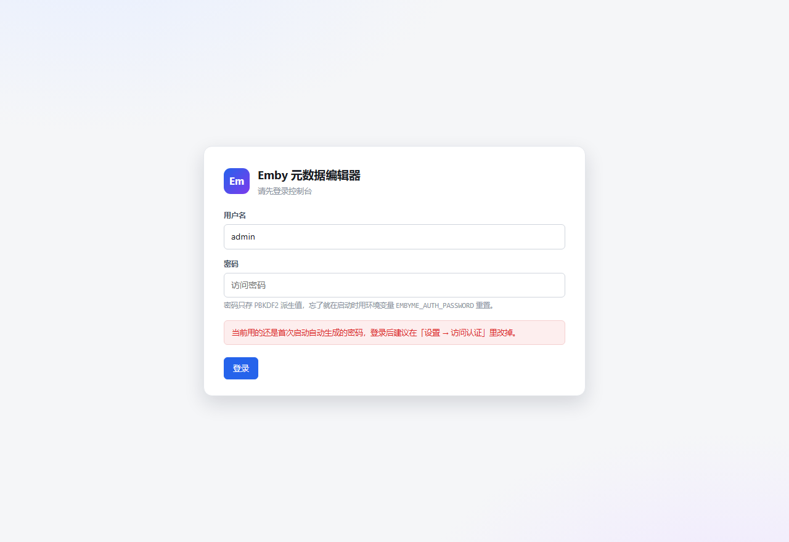
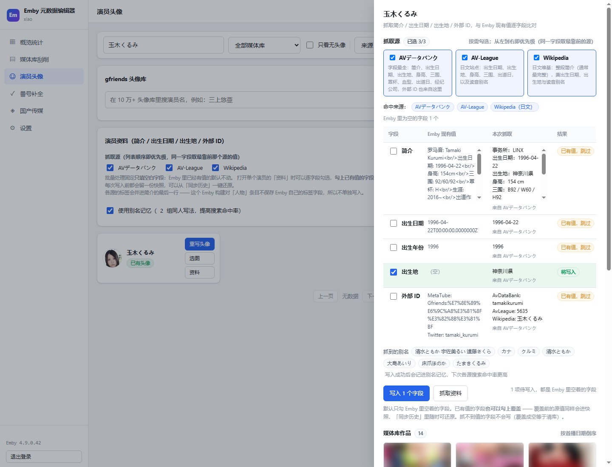

# Emby 元数据编辑器

一个用 Go 写的 Emby 媒体库管理工具。单文件 exe，双击即用，界面跑在本机浏览器里（默认只监听 `127.0.0.1`，不会暴露到局域网）。

> **界面自带访问认证** —— 用户名 + 密码，和 Emby 登录是两回事。密码只存 PBKDF2-SHA256 派生值，
> 会话是内存里的随机令牌；即使把端口开放到局域网也不至于「谁打开谁就是管理员」。详见[「关于访问认证」](#关于访问认证)。

> **下载** —— [最新版 `EmbyMetaEditor.exe`](https://github.com/huangmoling/EmbyMetaEditor/releases/latest/download/EmbyMetaEditor.exe)（Windows 64 位，约 8.8 MB，无需安装任何运行库）
>
> **Docker** —— [`aag111/emby-meta-editor`](https://hub.docker.com/r/aag111/emby-meta-editor)（linux/amd64 + arm64），一条命令起容器，见[「Docker 镜像」](#docker-镜像)。
>
> 不想下载也可以从源码构建，见[「从源码构建」](#从源码构建)。

围绕八件事：

| 模块 | 能力 |
|---|---|
| **访问认证** | 保护「谁能打开这个界面」：用户名 + 密码登录，PBKDF2 派生存储，登录失败按 IP 退避 |
| **Emby 登录** | 用户名 / 密码 或 API Key 两种方式，凭据本地保存 |
| **MetaTube 刮削** | 单个 / 批量刮削元数据与图片，**服务地址自行配置**（公共后端已下线，建议自建） |
| **gfriends 头像库** | 10 万+ 张头像索引；演员列表可**按媒体库筛选**，缺头像的一眼看完，单个挑或批量刮；「选图」弹窗会给每张候选标出**像素尺寸与文件体积**；索引与图片各带**两层 CDN 容错** |
| **演员资料** | 抓演员本人的简介 / 出生日期 / 出生年份 / 出生地 / 外部 ID（AVデータバンク + AV-League + Wikipedia 三源合并，**抓取源分列可选**），并列出**该演员在媒体库里的作品**；**打开面板先不抓**，点「抓取资料」才联网；默认**只填空白**，单卡可**勾选覆盖已有值**，可一键回滚 |
| **番号补全** | 按演员抓取全部番号，与本地媒体库比对找出缺失，抓取磁力列表（**按体积从大到小排序**）；**按番号并排分页**，磁力结果**带连通性诊断** |
| **国产传媒专项刮削** | 选媒体库 → 列出条目 → **单个刮削 / 勾选多个批量刮削 / 直接编辑元数据**；四站（xChina / 麻豆区 / 麻豆社 / 7mmtv）并发搜索，**封面 → 标题 → 标签 → 日期** 按优先级合并 |
| **媒体库统计** | 各媒体库条目数、电影 / 剧集 / 集数 |

---

## 快速开始

### 方式一：双击

直接双击 `EmbyMetaEditor.exe`，会自动打开浏览器进入控制台。

### 方式二：命令行

```bash
EmbyMetaEditor.exe                 # 默认 127.0.0.1:8097，自动开浏览器
EmbyMetaEditor.exe -port 8098      # 换端口
EmbyMetaEditor.exe -open=false     # 不自动开浏览器
EmbyMetaEditor.exe -dir D:\data    # 指定数据目录
EmbyMetaEditor.exe -host 0.0.0.0   # 允许局域网访问（注意凭据安全，见下）
```

首次启动会在程序目录生成 `config.json`（配置）和 `cache/`（gfriends 索引缓存，约 10 MB，下载一次可离线复用）。

**首次启动会生成一个随机访问密码并打印在控制台**，用它登录后可在「设置 → 访问认证」里改掉。
忘了密码就用环境变量重新指定一次：

```bash
EMBYME_AUTH_USER=admin EMBYME_AUTH_PASSWORD=你的新密码  EmbyMetaEditor.exe
# Windows PowerShell：$env:EMBYME_AUTH_PASSWORD="你的新密码"; .\EmbyMetaEditor.exe
```

### 方式三：Docker

本机或 NAS 上有 Docker / Docker Compose 的话，不用下载 exe，也不用源码：

```bash
docker run -d --name emby-meta-editor \
  -p 8097:8097 \
  -e EMBYME_AUTH_USER=admin \
  -e EMBYME_AUTH_PASSWORD=换成你自己的密码 \
  -v emby-data:/data \
  aag111/emby-meta-editor:latest
```

起来后浏览器访问 `http://127.0.0.1:8097`（或 NAS 的地址），用上面那个账号密码登录。
配置存在命名卷 `emby-data` 里的 `config.json`。仓库里的 `docker-compose.yml` 是同一个东西的 compose 写法。

> 不传 `EMBYME_AUTH_PASSWORD` 也能起：容器会生成一个随机密码，用 `docker logs emby-meta-editor`
> 在第一屏就能看到（只在首次生成时打印一次）。密码忘了就带着这个环境变量重启一次 —— 它是唯一的找回入口。
>
> 界面自带的认证挡的是「谁能打开这个界面」。**要暴露到公网仍然必须在前面套一层 HTTPS 反代**
> （Caddy / Nginx / 群晖反代都行）：容器本身只跑 http，cookie 里也就带不了 `Secure`。
> 反代之后所有请求的 `Host` 要和浏览器看到的一致，否则写请求会被同源校验（CSRF 防护）拒掉。

### 使用顺序

0. **访问认证** —— 首次启动的控制台里有随机密码；登录后可随时在「设置 → 访问认证」修改。
1. **登录** —— 填 Emby 地址 + 用户名密码，或切到 API Key 模式。
   API Key 在 Emby 后台「高级 → API 密钥」里生成。
2. **概览统计** —— 看媒体库数量分布、缺头像演员数。
3. **媒体库刮削** —— 选媒体库、筛「只看无海报」、批量刮削；点单个卡片的「刮削」或「详情」可手动搜索匹配。
4. **演员头像** —— 先选媒体库（默认全部），默认只列出无头像的演员，点「刮削」单个处理，「批量刮削头像」按数量批量跑。点「选图」从候选里挑一张（每张下面标着像素尺寸与体积，按这两个数挑最清晰的）。点「资料」会打开面板并**立即列出该演员在媒体库里的作品**（只读本地 Emby）；要抓资料得自己点「抓取资料」——面板里可以逐个源勾选这次从哪几个站导。
5. **番号补全** —— 填演员名（或 javbus 演员页地址），统计后得到缺失番号网格，勾选后抓磁力；磁力列表按番号并排分页，点标签切换查看，每个番号的磁力按**体积从大到小**排。
6. **国产传媒** —— 先选媒体库再点「查询」，列出该库条目；每张卡可以**单独刮削**、**勾选后批量刮削**，或点「编辑」直接改名称 / 简介 / 日期 / 标签 / 类型。

---

## 配置项

全部可在界面「设置」里改，也可以直接编辑 `config.json`。

| 配置 | 默认值 | 说明 |
|---|---|---|
| `emby_url` | `http://127.0.0.1:8096` | Emby 服务器地址 |
| `metatube_url` | `http://127.0.0.1:8080` | MetaTube Server 地址，**必填自建实例** |
| `metatube_token` | 空 | MetaTube 实例开了鉴权时填写 |
| `gfriends_tree_url` | jsdelivr 上的 Filetree.json | 头像索引地址 |
| `gfriends_cdn` | jsdelivr 上的仓库根 | 头像图片前缀 |
| `javbus_url` | `https://www.javbus.com` | 可换成镜像站 |
| `javbus_cookie` | `age=verified; dv=1; existmag=mag` | javbus 的年龄验证 + 磁力开关 |
| `proxy` | 空 | HTTP 代理，留空则读系统环境变量 |
| `concurrency` | 4 | 批量任务并发数 |
| `javbus_interval_ms` | 1500 | javbus 请求间隔，别调太小 |
| `cn_sites` | 四个站点的官方地址 | 国产传媒专项刮削的站点地址表，可换镜像；留空项自动回落到默认 |
| `openai.base_url` | 空 | 翻译用的 OpenAI 接口地址（填到「接口根」即可，如 `https://api.openai.com/v1`） |
| `openai.api_key` | 空 | OpenAI / 中转的 API Key |
| `openai.model` | `gpt-4o-mini` | 翻译用的模型名 |
| `openai.enabled` | false | **翻译总开关**：关掉则刮削不调用翻译 |
| `insecure_tls` | false | 自签证书的 Emby 勾上 |
| `auth.username` | `admin` | 界面访问用户名 |
| `auth.password_hash` | 首次启动自动生成 | 访问密码的 PBKDF2 派生值（**不存明文**；改这里没用，要重置见下） |
| `auth.password_generated` | true | 是否还是首次自动生成的密码，界面上据此提示「建议改掉」 |

### 关于访问认证

这一层和 Emby 登录**没有任何关系**：它保护的是「谁能打开这个界面」。因为界面里能读到 Emby 的
API Key、能改媒体库、能上传图片 —— 端口一旦映射到局域网，没有这层就等于把管理员权限摊在网上。

密码从哪来，按优先级：

1. 环境变量 `EMBYME_AUTH_PASSWORD`（每次启动都会重新派生并覆盖，**这就是找回密码的方式**）
2. `config.json` 里的 `auth.password_hash`
3. 都没有 → 生成一个随机密码打到控制台，Docker 里就是 `docker logs`

具体做法：

- 密码存的是 **PBKDF2-SHA256（20 万轮 + 16 字节随机盐）** 派生值，比对用常量时间比较。
  `config.json` 被备份、被贴出来求助都不会直接泄露密码。
- 会话是**内存里**的 32 字节随机令牌，不落盘：进程重启 = 全部登出，
  卷里那份 `config.json` 被拿走也换不到一个可用会话。代价是容器重启后要重新登录一次。
- Cookie 带 `HttpOnly` + `SameSite=Lax`，JS 读不到；进程里默认是明文 HTTP，所以**没加 `Secure`**
  （加了登录直接失效）。要上公网请在前面套 HTTPS 反代。
- 写请求校验 `Origin` / `Referer`，并且所有写接口只收 JSON —— HTML 表单伪造不出 `application/json`，
  这是 CSRF 的第二道闸。
- 登录失败按来源 IP 退避：前两次不罚，之后 3s → 10s → 30s → 2min → 5min → 15min。
- 改密码要验旧密码，改完**会踢掉其他所有会话**（当前这个留着），所以怀疑密码泄漏时改一次就能收口。
- **敏感项不再下发到页面**：Emby 密码 / API Key / 令牌、MetaTube token、javbus cookie、OpenAI key
  都只在服务端。设置页对应输入框显示「已保存，留空则不修改」——**留空提交 = 不修改**。
  真想清空某一项，编辑 `config.json`（这几项删成空串即可）。
- 顺带的副作用：Emby 的海报 / 头像改由服务端带令牌代取（`/api/emby/image`），
  令牌不再出现在 `` 里，也顺手解决了「页面是 http、Emby 是 https 自签证书」被浏览器拦掉的问题。

### 关于 MetaTube

官方公共后端已下线，需要自己跑一个：

```bash
docker run -d --name metatube -p 8080:8080 metatube/metatube-server:latest
```

装好后把 `metatube_url` 填成 `http://你的IP:8080`，在「设置 → MetaTube → 获取 provider 列表」点一下能列出 `FANZA / MGStage / DUMMY` 之类就算通了。

搜影片时**不指定 provider 更稳**：指定了会强制走那一个站点的抓取器，某个抓取器挂掉就是 500。不指定则由服务端并发查所有站点再聚合，实测同一个番号能同时拿到 `JavBus` / `JAV321` 两家的结果，按番号精确匹配取最合适的一条。

### 关于 Emby 的 API Key 登录

API Key 在 Emby 后台「高级 → API 密钥」生成，直接填进「设置 → API Key」即可。

注意：**API Key 是服务器级的，不绑定具体用户**。Emby 4.9.x 上用 API Key 请求 `/Users/Me` 会返回 500（`Unrecognized Guid format`），所以工具做了多级回退——先试 `/Users/Me`，不行就用已保存的 `user_id` 查 `/Users/{id}`，再不行列 `/Users` 挑一个。你只要在界面上正常登录过一次，身份就存下来了，之后一直能用。

### 关于 gfriends

`raw.githubusercontent.com` 在国内基本直连不了，所以默认走 jsdelivr CDN。索引文件有 6.5 MB，代码里带**两层备用地址**，换 CDN 不用重新下索引：

| 故障面 | 备用 |
|---|---|
| **仓库** | `gfriends/gfriends`（主）→ `xinxin8816/gfriends`（内容一致的镜像，索引与全部图片逐字节相同）。主仓库被删 / 改名 / 被 jsdelivr 限流时还有得用 |
| **CDN 节点** | `cdn.jsdelivr.net` → `gcore.` / `fastly.`（jsdelivr 的公开分片域名，DNS 与边缘节点各自独立）→ `raw.githubusercontent.com`（完全不同的基础设施，连 jsdelivr 整体挂掉都能兜住） |

**索引和图片都走这套备用列表**，只兜索引等于没兜（索引下得回来、图全下载失败，「刮削头像 / 选图」照样整体不可用）。图片的回落只在**主基址一张都没取下来**时才触发，正常网络下零额外请求；备用基址单次尝试上限 30 秒，不至于把一次刮削拖到十几分钟。

设置里自己填了别的镜像站（内网自建等）时**不会**被追加这些外网地址 —— 按你的配置原样使用。

- **高清优先**：同一演员在库里往往有多张头像（不同分辨率），自动刮削时会先量每张的尺寸（宽 × 高），选最大的一张上传——对齐 Emby 自带 gfriends 插件的行为。
- **手动选择**：演员列表点「选图」可以看到所有候选头像，点哪张换哪张。**每张候选下面标着它的像素尺寸与文件体积**（`640×960 · 130 KB`）—— 同一个演员常有一堆同名候选，缩略图都缩到 88px，光看图分不出哪张是原图、哪张是压缩过的小图，这两个数才是挑图的依据。这两个数只能由服务端代取（浏览器读不到一张图的字节数，跨域 `fetch` 又被 `connect-src 'self'` 挡着），走 `POST /api/img/info`；顺带把图写进服务端缓存，所以缩略图随后是秒开。选中后上传的就是你点的那张；如果那张在索引里已被移除，会明确报错提示重新搜索，不会静默换成第一张。客户端传回的地址**只用来定位是哪一张**，实际下载永远走服务端配置的基址（不会拿它当「去任意地址取图」的入口）。

### 关于演员资料（演员头像页）

除了头像，「演员头像」页的每张卡片还能抓**演员本人的资料**：简介、出生日期、出生年份、出生地、外部 ID，并列出**该演员在媒体库里的作品**。三个源并发搜，按字段优先级合并：

| 源 | 取什么 |
|---|---|
| **AVデータバンク**（`av-db.net`） | 字段最全：生年月日 / 出身地 / 身长・三围 / 血型 / 爱好 / 所属事务所 / 别名 / 标签，也是外部 ID（`avdb`）的来源 |
| **AV-League**（`av-league.com`） | 生年月日 / 出身地 / 三围 / 所属事务所，命中时用来互相印证 |
| **Wikipedia（日文）** | 简介段落，偏生平与职业经历 |

**抓取是显式动作，打开面板不联网。** 点「资料」只打开面板，里面立刻给你两样**本地**能拿到的东西：一组**分列显示**的资料源（每个源下面写清它会填哪些字段，自己决定这次从哪几个站导 —— 左右顺序就是优先级），以及该演员在媒体库里的作品列表。要抓才点「抓取资料」：一次抓取要并发访问三个外部站点（秒级），而多数时候点进来看的是「他有哪些片」；一进来就替你联网，既慢又白给上游添流量，站点稍有波动还会让整个面板开不了。侧栏那组源开关和面板里这组是**同一份状态**，哪边改另一边都跟着变。

**默认只填空白，单卡可以按勾选覆盖。** 写入前先读一遍 Emby 里现有的值，界面上把每个字段分成三类：

| 情况 | 界面表现 | 默认行为 |
|---|---|---|
| Emby 里是空的，本次抓到了 | 勾选中、可点 | **会写入** |
| Emby 里已有值，本次也抓到了 | 没抓到值的不给勾 | 默认**跳过**（显示「已有值，跳过」）；**想覆盖就手动勾上**，判定会立刻变成「将覆盖原值」，主按钮也会写明「含 N 项覆盖」并变成危险色 |
| 本次没抓到 | 勾选框 disabled | 不动 |

也就是说：**批量路径（「按当前条件」/「按数量上限」）永远只填空白**，不会碰任何已有值；唯一能改动已有值的入口是单卡面板上你亲手勾的那几个字段 —— 勾了才写，不勾不动。每次写入前都会留一份快照，「同步历史」里可以一键还原到写入前的状态 —— 回滚是破坏性操作，所以要**点两次**才真的执行。

- **该演员在媒体库里的作品**：资料面板下半部分会列出这位演员在 Emby 里参演的全部条目（封面 / 番号或标题 / 年份 / 所属媒体库），按首播日期倒序。库名是拿 `GET /Library/VirtualFolders` 的路径去匹配条目 `Path` 算出来的（`Views` 那个接口**不返回 `Path`**，靠它拿不到库名）；作品数多于一屏时点「再加载」继续拉。
- 抓取前用「同字串 + 读音拆分」两轮匹配，避免把同名不同人写成同一个人；命中后还要「详情页姓名确认」才算数（`minMatchScore` / `minDetailMatchScore`）。
- 「使用别名记忆」会把「简繁 / 假名 / 罗马字」这类同一人的写法记进 `cache/actor_aliases.json`（和旧版「Emby演员扩展器」的 `data/演员别名记忆.json` 同构），下次直接命中，不用再猜。
- **标签（「タグ」）不写进 Emby 的 `Tags`，而是并进简介的最后一行。** 原因是这个 Emby 构建对 `Person` 条目的 `Tags` 是**收下但不保存**的（POST 204，但详情 / 列表 / 标签字典里都没有），写了会「看起来成功、实际没有」，还会把用户自己填的标签覆盖掉。详见「踩过的坑」。
- 支持批量：工具栏「按当前条件」或「按数量上限」，一次给多个演员补资料。

### 关于 javbus

- 站点需要 `age=verified` 之类的 Cookie 才给看内容，默认值已内置。
- 如果被 Cloudflare 拦（返回 403 + "Just a moment"），从浏览器 F12 里复制完整 Cookie（含 `cf_clearance`）粘进设置。
- 抓磁力要请求作品详情页 + 一个 ajax 接口，所以每个番号约 2 次请求，代码里默认限速 1.5 秒 / 次、并发 2。
- 抓到的磁力列表**按体积从大到小排序**（`1.83GB` / `2.57 GB` 这类字符串直接比大小是错的，代码会先换算成字节；体积解析不出来的排到最后，同体积的保持原顺序）。
- 番号补全只列**缺失番号**。「本地有、javbus 未列出」那一类不再单独成块 —— 本地已有的条目本来就没什么可补的。
- **抓不到东西时，先点「连通性诊断」。** 它会在输入框有内容时顺便测一次演员搜索接口。

#### 连通性诊断

javbus 这类站点出问题的原因有好几种，光看「抓取失败」分不出来。点一下诊断，它会把结论直接摊开：

| 现象 | 诊断给出的结论 |
|---|---|
| 域名解析不了 / 连接被拒 / 超时 | 无法连接 —— 检查网络或代理，也可以换个镜像地址 |
| HTTP 200 但**响应体是空的** | 被本机网络或运营商拦截了（这是国内最常见的形态） |
| 页面含 `Just a moment` / `cf-browser-verification` | 被 Cloudflare 拦了 —— 去浏览器复制含 `cf_clearance` 的完整 Cookie |
| 能连上但页面里没有影片列表标记 | 可能返回的是验证页或公告页，**原始页面已存到 `cache/debug/`** |
| 演员搜索接口返回空数组 | 站内没有这个演员名，换个写法或直接填演员页地址 |

诊断结果里还会列出 HTTP 状态、响应大小、耗时、以及页面上各结构标记（`movie-box` / `photo-frame` / `pics/cover` …）的出现次数。判断不了的时候，去 `cache/debug/` 打开落盘的原始 HTML 看看到底返回了什么 —— 比猜快得多。

也可以用命令行直接调：

```bash
curl "http://127.0.0.1:8097/api/javbus/probe"
curl "http://127.0.0.1:8097/api/javbus/probe?q=三上悠亜"
```

#### 封面图片为什么要走服务端

javbus 的图片按 **Referer 防盗链**：同一张封面，不带 Referer 返回 403，带 `Referer: https://www.javbus.com/` 返回 200，带 `Referer: http://127.0.0.1:8097/` 同样 403。所以浏览器从本机页面直接 `` 必然拿不到图，页面上就是一片空白。

页面里所有外部图片都走 `/api/img?u=<原始地址>`：

| 目标主机 | 行为 |
|---|---|
| 白名单（当前配置的 javbus / gfriends / 国产传媒站点主机 + `pics.dmm.co.jp`、`cdn.jsdelivr.net`、`i0.wp.com`、`upload.xchina.io` 等公开图床） | 服务端带正确 Referer / 浏览器 UA 代取，内存缓存 6 小时 |
| 其他公网图床 | 302 回原地址，浏览器直连 —— 效果与直连完全一致 |
| 内网地址、非 http(s) | 502 拒绝，避免这个接口变成 SSRF 跳板 |

「哪些图需要代取」的策略只写在服务端，所以你把 javbus 换成镜像域名时不用动前端。

> 国产传媒的封面必须走代理：`upload.xchina.io` 对**浏览器**返回 Cloudflare 挑战页（页面上表现为 `ERR_BLOCKED_BY_RESPONSE`，图片全白），而服务端带浏览器 UA 去取就是正常的 200。这类「接口通、页面白」的坑只能靠渲染层回归发现，见下面的 `verify_cn_view.py`。
>
> 白名单里以 `.` 开头的条目是**后缀匹配**（`.xchina.io` 同时匹配 `xchina.io` 和 `upload.xchina.io`），但不会匹配 `xchina.io.evil.com` 这种伪装域名。

```bash
curl -I "http://127.0.0.1:8097/api/img?u=https%3A%2F%2Fwww.javbus.com%2Fpics%2Fcover%2F83hf_b.jpg"
# HTTP/1.1 200 OK
# Content-Type: image/jpeg
# Cache-Control: public, max-age=21600
```

### 关于国产传媒专项刮削

欧美 / 日本番号有 MetaTube 兜底，国产传媒（麻豆、果冻、天美这类）基本没人做，只能去聚合站捞。工具内置四个站点的适配器，同一个番号**四站并发搜**，然后按字段优先级合并：

| 站点 | 搜索方式 | 特点 |
|---|---|---|
| **xChina**（`xchina.co`） | 服务端渲染的搜索页 | **命中率最高**，标题和你的库基本对得上；详情页有 Cloudflare，只取搜索页 |
| **麻豆区**（`madouqu.com`） | WordPress `?s=` | 字段最全（封面 / 标题 / 分类 / 演员 / 日期），但**搜索是模糊的**，必须自己过滤 |
| **麻豆社**（`madou.club`） | WordPress `?s=` | 偏 MDHG 系列，不含 91CM 系列（0 命中是正常的，不是故障） |
| **7mmtv**（`7mmtv.sx`） | 表单式搜索路径 | 国产番号覆盖一般，偶尔能补上别人没有的 |

**字段优先级：封面 → 标题 → 标签 → 日期。** 每个字段单独取值：谁先命中就用谁，互不干扰。四个字段固定全开，界面上不做勾选。

**只认精确匹配。** 麻豆区搜 `91CM-014` 会返回 `91CM074` / `91CM084` / `91CM094` 一堆近似结果，这些**一律丢弃**，不会当成命中写进你的库。番号比对走的是归一化后的 key（`91CM-014`、`91CM074`、`91CM-74` 都归一到同一形态再比），所以补零写法不同也能对上。

**先选媒体库再查询。** 国产传媒不会在整库上瞎跑 —— 库下拉里**没有**「全部媒体库」这个选项，选好库点「查询」才列出条目。这样既能避免把 `91CM-014` 往日本片库里套，也顺带把请求量压下来。

三种操作方式，都在列出的条目上直接做：

- **单个刮削** —— 卡片上的「刮削」，只处理这一条。
- **勾选多个批量刮削** —— 卡片右上角有勾选框，可以「全选本页」，再点「刮削选中」。勾选状态翻页不丢，任务跑完自动清空并刷新。
- **编辑元数据** —— 卡片上的「编辑」，改名称 / 原始标题 / 简介 / 发行日期 / 年份 / 标签 / 类型 / 分级。

编辑这块有个**刻意的限制**：只提交你改动过的字段。Emby 的 `POST /Items/{id}` 是整对象替换，把没碰过的字段一起发过去是要出事的。所以发行日期和年份**留空表示不修改**（不会清掉已有值），名称不能为空，标签 / 类型提交空数组才算清空。

标题的自动覆盖很保守：只有当前标题为空、等于番号、是个文件名、或者带下载站水印（`hhd800.com@…` 这类）时才覆盖，已经是像样片名的不动；要强制覆盖勾上「覆盖已有标题」。封面同理，默认已有封面就跳过，除非勾「覆盖已有封面」。

站点地址在「设置 → 国产传媒站点」里可以换成镜像，`config.json` 里对应 `cn_sites`。每站独立限速（默认 700ms / 次），批量任务会复用同一个限速器，不会因为并发把站点打挂。

想单独确认「某家站点认不认这个番号」，用只读接口：

```bash
curl "http://127.0.0.1:8097/api/cn/search?q=91CM-014"
```

---

### 关于翻译（OpenAI）

刮削番号（国产传媒 / MetaTube / javbus 路径）时，把**非中文的标题、简介**翻成简体中文，
方便在 Emby 里直接看中文名。

- **开关在「设置 → OpenAI / 翻译」**：填接口地址（官方 `https://api.openai.com/v1` 或任意兼容中转，
  如 `https://api.gptgod.online/v1`）、API Key、模型，再勾「启用翻译」即可。
- **兼容官方与各类中转**：代码只认 OpenAI 的 `chat/completions` 协议，地址里填「接口根」就行，
  拼路径（`/v1/chat/completions`）由程序自动处理。
- **只翻非中文**：含日文假名 / 韩文 / 纯英文的才翻；已经是中文的（或中日混排里带汉字的）不动，
  避免把中文片名再翻一遍。纯汉字的日文标题（没有假名）会被当成中文跳过——这类极少，
  且翻错比不翻更糟。
- **番号保留**：番号一般在标题最前面（`SSIS-001 xxx` / `91CM-014 xxx`），AI 翻译常把它一起翻掉。
  翻译前程序会把前导番号剥离，只翻其余部分，译完再原样拼回「番号 + 空格 + 译文」——
  番号永远完整保留。压制组 / 容器标记（HEVC10 / MP4 / CD1）不会被误当成番号。
- **标题保证带番号**：源标题本身不含番号时（纯日文标题、站点文案标题），
  刮削写入前会主动把识别出的番号补到标题最前面（`SSIS-001 中文标题`）；
  标题里已有该番号（任意常见写法，含 `SSIS001` / `ssis-1`）则不会重复添加。
  MetaTube 刮削与国产传媒刮削都生效，与是否开翻译无关。
- **缩略图一并刮削**：除了海报（Primary）和剧照（Backdrop），还会把 Emby 的
  **缩略图（Thumb，列表 / 横版视图用）** 一并刮进去——MetaTube 路径优先用横版剧照、
  没有就用封面；国产传媒路径复用封面。同样遵循「覆盖已有图片」开关。
- **原标题保留**：原标题是日文 / 韩文时，翻译写入标题的同时会把原文存进 Emby 的
  **OriginalTitle（原标题）字段**，Emby 里能同时看到中文标题与原始语言标题。
- **翻译失败不影响刮削**：接口超时 / 报错 / 没配 Key，一律静默退回原文，绝不阻断或拖慢刮削。
- 翻译是逐条调接口，批量任务里会跟着条目走；中转站有速率限制的话，慢一点是正常的。
- **连通性测试**：设置页填完接口地址 / Key / 模型后，点「**测试连接**」即可探测
  （地址可达 + Key 有效 + 模型可用）三项是否通过，结果实时显示在按钮右侧（绿=成功 / 红=失败 + 原因）。
  测试**不依赖**「启用翻译」开关，关着也能先测通再开；留空的字段会自动用已保存的配置。
  测试只发一次极小的对话请求（`max_tokens=1`），不写任何数据、不消耗翻译额度以外的东西。

---

## 界面

| 访问认证 | 登录 |
|---|---|
|  |  |

| 概览统计 | 媒体库刮削 |
|---|---|
|  |  |

| 详情与手动匹配 | 演员头像 |
|---|---|
|  |  |

| 番号补全 | 连通性诊断 · 正常 |
|---|---|
|  |  |

| 连通性诊断 · 失败 | 磁力列表 · 按番号分页 |
|---|---|
|  |  |

| 演员资料（抓取源分列 / 现有值 vs 抓取值 / 媒体库作品） |
|---|
|  |

（截图里的数据来自本地 mock Emby / mock javbus，仅用于展示界面。
演员资料那张是在真实 Emby 上截的 —— 截之前脚本会先把侧栏的账号行藏掉，
作品封面也做了模糊处理，只保留「有封面 / 版面布局」这个事实。）

---

## 从源码构建

```bash
go build -trimpath -buildvcs=false -ldflags "-s -w" -o EmbyMetaEditor.exe .
```

单文件 exe，前端资源（`web/`）和图标（`rsrc_windows_amd64.syso`）都通过 `go:embed` / PE 资源嵌进去了，拷走 exe 就能跑。

加了 `-buildvcs=false`，构建是**可复现**的：照着上面这条命令重建，得到的文件与仓库里那个 `EmbyMetaEditor.exe` 逐字节一致。
不加这个参数的话 Go 会往产物里嵌当前 commit 的 VCS 信息，体积和哈希都会变 —— 那是正常的，不是源码漂移。

> 仓库里的 exe **跟着 main 走**（改完就重建提交），下载链 `releases/latest/download/` 要**发版时**才更新，两者不一定同步 —— 所以下载下来的 exe 可能比 main 落后一个版本。
> 当前对齐的是 **v1.3.0**：Release 与 main 的 md5 同为 `085cf55c8944f1a739985208deec7f94`（9,276,928 字节）。

跑测试：

```bash
go test ./...
```

234 个用例，覆盖访问认证（PBKDF2 派生与坏哈希、会话签发/过期/踢其他会话、失败退避、同源校验、配置脱敏）、番号归一化（含 `91CM-014` 这类数字开头番号、**以及「`.mp4` 被当成番号」这种误报**）、javbus 页面解析（含备用结构回退、裸 `<tr>` 片段、真实详情页片段）、**磁力按体积倒序**（`1.83GB` / `2.57 GB` 这类字符串不能直接比大小、体积解析不出来排最后、真实夹具上验证是在**组装层**排序且不改动解析器返回的顺序）、连通性诊断的五种失败形态、MetaTube 字段兼容与 provider 结构兼容、Emby 用户身份解析的多级回退、图片代理的主机分类与缓存、**图片尺寸 / 体积探测**（真 PNG / JPEG 读像素、非图片返回全零而不是乱猜、白名单外的主机逐条拒绝、超上限只截断不报错）、演员按媒体库过滤、国产传媒四站解析与**只认精确匹配**的合并逻辑（含按勾选 id 批量、封面 raw→base64 回退上传）、**元数据编辑的「只提交改动项」语义**、演员资料的字段合并与写入策略（「只填空白」是默认、单卡带 `keys` 时按勾选写并可覆盖、类型化 nil、`ProviderIds` 断言失配那两个只在真实 Emby 上才暴露的坑）、**演员作品列表与库名映射**（`ParentId` 不是库 ID、库名只能从 `Library/VirtualFolders` 的路径按**最长前缀 + 分段对齐**匹配、库信息查不到时不拖垮整条链路）、**gfriends 的两层 CDN 容错**（回落只在主基址全挂时触发、候选基址必须都在图片代理白名单里、客户端给的地址不用于下载）、以及用 mock Emby + mock MetaTube 跑通的完整刮削链路。

国产传媒的夹具是 `tools/extract_cn_fixtures.py` 从 `cache/debug/` 里落盘的**真实响应**里按容器标签逐字节切出来的，不手写 —— 手写夹具最容易「顺手把 `<tr>` 补成 `<table>`」，结果单测全绿、线上全挂。

其中 mock Emby 是**按真实 4.9 构建的行为建模**的，不是「理想 Emby」：读详情只认用户作用域路由（全局路径返回 404）、写操作只认全局路径、`POST /Items/{id}` 是整对象替换、图片上传只收 base64 文本、列表接口不返回 `SortName`、`/Persons` 支持 `ParentId` 但传非法 GUID 会 500。线上踩过的坑因此都能在单元测试里复现，而不是等上线才发现。

### 验证脚本

下面这些脚本都要先过**访问认证**：起 exe 时带上 `EMBYME_AUTH_PASSWORD`，
脚本默认按 `test-pass` 登录（共用 `tools/wbauth.py`）。不带就只会看到一片 401。

```bash
export EMBYME_AUTH_PASSWORD=test-pass        # PowerShell: $env:EMBYME_AUTH_PASSWORD="test-pass"
EmbyMetaEditor.exe -port 8097 -open=false &  # 起应用，后面几个脚本共用这一个实例
```

访问认证本身的回归（**不需要 Emby，也不需要浏览器**，自己起临时实例、用完即删）：

```bash
python tools/smoke_auth.py
```

47 项断言：未登录时所有 `/api/` 一律 401、静态资源放行、跨站 Origin 被拒、
配置里没有任何明文密钥、密钥留空提交不会清空原有值、改密码要验旧密码且会踢掉其他会话、
退出后会话立即失效、连续失败会退避、环境变量指定密码生效。

Emby 图片代取链路（和直连 Emby 逐字节比对，只读）：

```bash
python tools/verify_emby_image.py
```

界面回归（可选）：起一个模拟 javbus 站点，用无头浏览器真实点击验证诊断按钮的渲染。

```bash
python tools/mock_javbus.py 9500 &          # 模拟 javbus
python tools/verify_javbus_probe.py         # 走 CDP 点击 + 截图 + 断言
```

实机冒烟（可选）：对真实 Emby / MetaTube / gfriends / javbus 跑一轮**只读**验证，逐项打印实测数字。

```bash
python tools/smoke_real.py
```

前端静态自检（不打开浏览器，比对 HTML / JS / 后端路由）：

```bash
python tools/check_frontend.py
```

页面图片的**渲染**回归（需要无头 Edge + 真实 config.json）：

```bash
"C:/Program Files (x86)/Microsoft/Edge/Application/msedge.exe" \
  --headless=new --disable-gpu --remote-debugging-port=9333 \
  --remote-allow-origins=* --user-data-dir=C:/Users/xiao/AppData/Local/Temp/edgeimg about:blank &
python tools/verify_images.py
```

它会真的点「统计番号」、等结果、**逐个 `scrollIntoView` 触发懒加载**，然后断言每张图的
`` 都走了服务端代理且 `naturalWidth > 0`，最后截图到 `screenshots/`。
覆盖三处：番号补全的缺失番号封面、MetaTube 搜索结果的封面、gfriends 头像库的缩略图。

「选择头像」弹窗是 `imgSrc()` 的**第四个**调用点，上面那条覆盖不到，单独跑：

```bash
python tools/verify_gfriends_pick.py
```

它点演员卡片上的「选择」打开弹窗、用固定关键词搜一次，断言 `#pkList` 里每张候选图
都走了 `/api/img`、`naturalWidth > 0`，并检查没有 CSP 拦截报错 —— 这个 bug 用命令行
查不出来（CDN 外链 `curl` 是 200，只有浏览器会被 `img-src 'self'` 拦掉）。

还会等那行「宽×高 · 体积」补上来（它是**异步**探的：服务端要去取原图，所以先出图、后补小字），
然后断言候选数 = 小字行数、没有停在「还没探完」、几乎每张都同时拿到了尺寸和体积。
这三档必须分开数：只数「有几个带 ×」的话，一个卡住的探测会被当成「刚好没探完」混过去。

演员按媒体库筛选的**交互**回归（同样需要无头 Edge + 真实 config.json）：

```bash
python tools/verify_person_lib.py
```

它会真实点击进入「演员头像」，记录「全部媒体库」的演员总数与卡片，
再逐个切换媒体库下拉，断言：分页说明里出现所选库名、该库演员数小于全局、
卡片确实换了一批人、能切回全部媒体库，且全程没有 console 报错。

> 「接口返回了 JPEG」和「页面上看得到图」是两件事，这个脚本验证的是后者。

磁力列表按番号分页的**渲染**回归：

```bash
python tools/verify_magnet_tabs.py
```

它会在注入的磁力数据上断言：每个番号一个标签、同时只有一个面板可见、空结果的番号标红、
点标签真的切到对应面板、「复制当前番号」复制的是当前标签而不是全部、重新渲染后选中项不丢，
以及没有数据时显示占位而不是空白。

国产传媒专项刮削的**渲染**回归（41 项）：

```bash
python tools/verify_cn_view.py
```

覆盖：导航项、旧界面（站点卡片 / 试运行 / 抓取字段勾选）确实被删掉、库下拉**没有**「全部媒体库」、
未选库时是提示态、选库点「查询」真的渲染出 24 张卡、每张卡有勾选框和「编辑」、
**封面真的渲染出来（`naturalWidth > 0`）**、勾选 / 全选 / 取消的计数与高亮、
**重新渲染后选中状态不丢**、「刮削选中」打到 `/api/cn/scrape-batch` 且 `ids` 就是勾的那几个、
单个「刮削」打到 `/api/cn/scrape`、编辑抽屉只把改动过的字段提交给 `/api/items/update`，
最后截图。

> 会写 Emby 的地方一律把 `api()` 换成假的：记录请求、POST 返回假结果、GET 转交真实实现。
> 既验到了交互，又零副作用。

> 统计图片前会先 `scrollIntoView()` —— `loading="lazy"` 的图在视口外永远是 pending，
> 不滚一遍就会误报「没图」。这正是发现「接口返回 200 但页面全白」那个 bug 的关键。

演员**资料**（简介 / 出生日期 / 出生地 / 外部 ID）的服务端冒烟：

```bash
python tools/smoke_profile.py                 # 只读
PROFILE_LIVE=1 python tools/smoke_profile.py  # 再加上真实写入 → 校验 → 回滚 → 校验还原
```

只读模式验：资料源清单与写入策略（`only_blank` / 单卡 `as_picked`）**以及每个源都带一句「它会填哪些字段」的说明**
（界面在面板里分列摆的就是它，少了这个用户看到的就是三个光秃秃的名字）、挑一个真实演员**逐字段**核对「只填空白」、
连「已有值 + 本次抓到」的字段也必须**默认可勾选但不写入**（默认仍是只填空白）、
连续预览不产生同步历史、以及错误路径（空名 / 空 ID / 查不到的演员一律 4xx，坏的回滚 ID 报错）。
`PROFILE_LIVE=1` 会真的写进 Emby 再回滚，验证「写完确实变了、回滚后逐字段还原、同一条不能回滚两次」；
再走一遍**勾选覆盖**：把「已有值也被本次抓到」的那批字段显式写入，断言 `overwritten` 回报、提示语写明覆盖与可回滚、
Emby 侧的值确实换成了抓取值（按语义比 —— 日期会被 Emby 规范化、`provider_ids` 是合并写，直接比字符串会假 FAIL）、
覆盖不会把字段写空，最后回滚并逐字段比对还原。

> 跑之前把 `NO_PROXY` 带上 `127.0.0.1`（本机若设了 http 代理，`127.0.0.1` 也会被转发出去，
> 脚本会满屏 502）。跑完它会往 `cache/sync_history.json` 留记录 —— 这是正常的。

演员资料面板的**界面**回归（需要无头 Edge + 真实 config.json）：

```bash
python tools/verify_profile_view.py
```

断言：资料源默认全选且状态标签跟着勾选变、工具栏有「强制覆盖已有头像」、每张卡三个操作
（头像 / 选图 / 资料）、有头像的卡按钮是「重写头像」、无头像的是「刮削头像」；
再搜一个真实演员点开「资料」，先验**未抓取态**：打开面板**不允许发出任何抓取请求**、
不许有对照表、资料源**分列**列出且每列都写了说明、按钮是「抓取资料」、界面上不再有「重新抓取」这个旧文案；
然后在面板里取消一个源，断言侧栏那份同步变成未勾选（两处是同一份状态），再点「抓取资料」——
最后对账「抓取请求数 == 点按钮的次数」，多了就说明某处在偷偷自动抓。
抓到之后断言对照表**渲染出全部受管字段**、**没有 `tags` 行**、
「Emby 已有值」的行勾选框**可勾选但默认不勾**（支持覆盖）、「将写入」的行勾上且可点、
判定为跳过的行不许勾、没抓到值的行禁用；
接着验**媒体库作品**区块（单独接口拉取、卡片带番号/年份/库名、封面全走同源地址且没有破图），
勾上一个覆盖行后断言判定变成「将覆盖原值」、按钮文案写明「含 N 项覆盖」并变危险色、
**且没有发出任何写入请求**，取消勾选后文案复原；再验作品多于一屏时的「再加载」会带更大的 `limit` 重新查询；
最后打开「同步历史」，断言每条记录都有明确状态（回滚按钮 或 已回滚标签）。
全程只读（回滚按钮只点到「确认回滚？」那步），并检查没有 console 报错 / CSP 拦截 / 4xx-5xx。

> 脚本会保证样本**非空** —— 找不到「Emby 已有值 ≥ 1 **且** 可写 ≥ 1」的演员就逐个换候选，
> 换完都找不到直接判 FAIL。否则「只填空白」那几条断言会在一个抓不到资料的演员上**空过**。
> 候选名单可用 `VERIFY_STARS="玉木くるみ,心花ゆら"` 覆盖。
> 「只看无头像」默认勾着，而有头像的演员才更可能"填了一半"，所以脚本会先取消这个过滤。

---

## Docker 镜像

已发布：**[`aag111/emby-meta-editor`](https://hub.docker.com/r/aag111/emby-meta-editor)**（公开，linux/amd64 + arm64，压缩后约 7.5 MB）

```bash
docker pull aag111/emby-meta-editor:latest
```

镜像定义在仓库根目录的 `Dockerfile`，两阶段构建：`golang:1.27-alpine` 里编译，
只把二进制搬到 `alpine:3.22`（外加 `ca-certificates` + `tzdata`）。

几个不显眼、但少一个就跑不起来的地方：

- **`CGO_ENABLED=0`** —— 产物是纯静态 ELF（实测无 `PT_INTERP` / `PT_DYNAMIC`），
  运行层不需要 glibc/musl，也不挑 libc 版本。
- **运行层必须装 `ca-certificates`** —— Emby / MetaTube / javbus / gfriends 全是 HTTPS，
  Go 在 Linux 上会去读 `/etc/ssl/certs/ca-certificates.crt`；这张表缺了**所有 TLS 请求都会证书校验失败**。
  只把静态二进制丢进 `scratch` 是能启动的，但一出网就挂，这是最容易被忽略的坑。
- **`-host 0.0.0.0` + `-open=false`** —— 只监听 `127.0.0.1` 的话端口映射进来的流量到不了；
  容器里也没有浏览器，别让它去调 `xdg-open`。这两条写在镜像的默认 `CMD` 里。
- **数据落在 `/data`**（`EMBYME_HOME`）—— `config.json` 与 `cache/` 都在卷里，容器重建不丢配置。
- **非 root（uid 1000）运行** —— 用宿主目录映射而不是命名卷时，先 `chown 1000:1000`。
- **`.dockerignore` 排掉了 `config.json` 与 `cache/`** —— 前者装着真实 Emby 令牌和 OpenAI key，
  绝不该进构建上下文。
- **有两个环境变量可以注入访问认证**：`EMBYME_AUTH_USER` / `EMBYME_AUTH_PASSWORD`。
  不传也能起，容器会自动生成随机密码并打到日志里（`docker logs`）；传了就每次启动都覆盖，
  这是忘了密码之后唯一的找回入口。
- **容器重启后需要重新登录** —— 会话存在进程内存里，不落盘（安全换来的代价）。
- **改了 `web/` 下的任何东西，必须重新打镜像** —— 前端是 `go:embed` 编进二进制的，
  源码修对了不等于镜像修对了。这是**唯一**一种「CI 全绿、镜像能拉、容器能起，但界面还是坏的」
  的故障：v1.0.8 的镜像就这么带着 gfriends 头像弹窗的 bug 发出去了。
  `tools/verify_docker_image.py` 现在会解开镜像层、在二进制里实查内嵌前端，专门守这一条。

本地构建（有 Docker 的机器上）：

```bash
docker build -t aag111/emby-meta-editor:latest .
docker run --rm -p 8097:8097 -e EMBYME_AUTH_PASSWORD=你的密码 -v emby-data:/data aag111/emby-meta-editor:latest
```

### 发布到 Docker Hub

`.github/workflows/docker.yml` 在**打 `v*` tag 时**自动构建 `linux/amd64` + `linux/arm64`
并推送到 Docker Hub；也可以在 Actions 页面手动触发（改完 Dockerfile 想先验一次，不用等发版）。

首次使用需要配两个 secret（Settings → Secrets and variables → Actions）：

| Secret | 值 |
|---|---|
| `DOCKERHUB_USERNAME` | Docker Hub 用户名 |
| `DOCKERHUB_TOKEN` | 访问令牌（Account Settings → Personal access tokens，权限 **Read & Write**） |

配好后打 tag 即发布：

```bash
git tag v1.3.0 && git push origin v1.3.0
```

镜像标签由 tag 推导：`v1.3.0` → `1.3.0` / `1.3` / `1` / `latest`（`latest` 始终跟着最新正式版）。
手动触发（`workflow_dispatch`）没有 tag 可比，只会推 `latest`。
镜像名固定为 `<DOCKERHUB_USERNAME>/emby-meta-editor`，第一次推送时 Docker Hub 会自动创建仓库
（公开仓库，匿名即可拉取）—— 所以 Docker Hub 的用户名改起来只动 secret，不用改代码；
README 与 `docker-compose.yml` 里写死的 `aag111/` 换用户名时一并替换即可。

> **注意**：Docker Hub 用户名（`aag111`）和 GitHub 用户名（`huangmoling`）不是同一个，
> 别照搬 GitHub 名去写镜像地址。

> 手动触发构建出来的镜像，`org.opencontainers.image.revision` = 触发时的 `main` HEAD。
> 也就是说**构建之后再往 main 提交，镜像就落后了** —— `tools/verify_docker_image.py`
> 会如实报 FAIL（它比对 `revision` 与本地 HEAD），重新触发一次构建即可，不是推失败了。
> 另外 dispatch 构建的镜像版本标签是 `latest`（不是语义版本），所以那个脚本会改从
> **镜像对应提交的 `version.go`** 里取版本串来比，而不是拿 `latest` 去拼一个不存在的 `vlatest`。

---

## 目录结构

```
main.go              启动、参数、控制台 UTF-8、自动开浏览器、打印初始密码
auth.go              访问认证：PBKDF2 派生、内存会话、失败退避、安全响应头 / CSRF 中间件
config.go            配置结构与持久化（含敏感字段脱敏）
api.go               HTTP 路由与处理函数
emby.go              Emby REST 客户端
imageproxy.go        图片代理：Referer 防盗链、白名单、6 小时缓存
imageinfo.go         图片尺寸 / 体积探测（「选图」弹窗那行小字；复用同一套白名单）
metatube.go          MetaTube v1 客户端
gfriends.go          gfriends 索引下载 / 缓存 / 查询
javbus.go            javbus 抓取、HTML 解析、连通性诊断
cnmedia.go           国产传媒四站抓取、番号归一化、精确匹配合并
scrape.go            刮削编排、番号比对
actorprofile.go      演员资料来源适配（AVデータバンク / AV-League / Wikipedia）、姓名匹配、字段合并
profile.go           演员资料编排：只填空白 / 按勾选覆盖、同步快照与回滚、别名记忆、演员作品列表
api_profile.go       演员资料相关路由（sources / preview / apply / batch / history / rollback / aliases / works）
jobs.go              后台任务与进度
util.go              番号归一化、HTML 辅助、HTTP 客户端
console_windows.go   Windows 控制台切 UTF-8
web/                 前端（原生 JS，无构建步骤）
tools/               验证脚本：模拟站点 / CDP 界面回归 / 前端自检 / 封面渲染 / 演员按库筛选 / 磁力分页 / 国产传媒 / 演员资料 / 夹具切取 / 实机冒烟
app.ico              图标源文件
Dockerfile           Docker 镜像定义（两阶段，静态链接）
.dockerignore        排除 config.json / cache 等，别把凭据带进构建上下文
docker-compose.yml   拉镜像运行的 compose 写法
.github/workflows/docker.yml  打 tag 自动构建并推送 Docker Hub
```

验证脚本一览：

| 脚本 | 验什么 | 需要什么 |
|---|---|---|
| `check_frontend.py` | HTML / JS / 后端路由静态对照 | 无 |
| `smoke_auth.py` | 访问认证 47 项：未登录必须 401、密钥不下发、跨站被拒、密钥留空不清空、改密码踢会话、暴力破解退避、环境变量指定密码 | 无（自建临时实例） |
| `verify_emby_image.py` | Emby 海报**代取**链路（与直连 Emby 逐字节比对） | 真实 config |
| `smoke_real.py` | 真实环境只读冒烟 41 项（含国产传媒四站搜索 / 批量 dry-run / 封面代理） | 起 exe + 真实 config |
| `verify_images.py` | 页面图片**真的渲染出来**（番号补全 / MetaTube 搜索 / gfriends 三处） | 起 exe + 无头 Edge |
| `verify_person_lib.py` | 演员按媒体库筛选的**交互**（切库、总数、卡片换批、切回） | 起 exe + 无头 Edge |
| `verify_magnet_tabs.py` | 磁力列表**按番号分页**（标签切换、复制当前 / 全部、空态） | 起 exe + 无头 Edge |
| `verify_cn_view.py` | 国产传媒**选库→列表→单选/多选刮削→编辑元数据**（41 项，写路径全用假 `api()`） | 起 exe + 无头 Edge |
| `smoke_profile.py` | 演员资料只读冒烟（源清单与每源的说明 / 只填空白 / 预览无副作用 / 错误路径）；`PROFILE_LIVE=1` 再加真实写入 → 回滚 → 校验还原，**以及勾选覆盖已有值 → 回滚 → 校验还原** | 起 exe + 真实 config |
| `verify_profile_view.py` | 演员资料面板**渲染与抓取时机**（打开面板不发抓取请求、源分列与说明、两处源勾选同步、点「抓取资料」后请求数对账、对照表可勾选/默认勾选状态、媒体库作品区块、勾选覆盖的按钮文案与配色、作品「再加载」分页、同步历史状态；样本非空） | 起 exe + 无头 Edge |
| `extract_cn_fixtures.py` | 从 `cache/debug/` 的原始响应里切测试夹具 | 落盘的原始 HTML |
| `mock_javbus.py` + `verify_javbus_probe.py` | 模拟站点 + 诊断按钮的界面交互 | 起 exe + 无头 Edge |
| `verify_docker_image.py` | 推上去的镜像**确实是这份代码**（匿名拉 manifest：多架构、`revision` = 本地 tag / HEAD、`source` = 本仓库、入口参数、非 root；**再解开层在二进制里实查内嵌的 `app.js` 和版本串**） | 能连 Docker Hub |
| `live_test.go`（`EMBY_LIVE=1 go test -run TestLive`） | 实机**写**路径，幂等不改变数据 | 真实 config |

---

## 已知边界

- 刮削只处理 `Movie` 类型条目；剧集 / 分集不在范围内。
- 番号识别靠正则从片名和路径里提取，路径里带番号是最稳的。国产传媒那类**数字开头**的番号（`91CM-014`、`91BCM-002`、`18BT.NET-…`）走的是单独的提取逻辑，见下面踩坑表。
- javbus 页面结构如果改版，解析可能失效 —— `parseStarPage` / `parseMagnets` 已有单元测试夹具，改起来很快。真改版了先跑「连通性诊断」，看 `cache/debug/` 里的原始页面就知道新结构长什么样。
- javbus 有反爬。限速默认 1.5 秒 / 次、并发 2，别调太激进。
- 访问认证是**进程自己的**登录，和 Emby 登录无关。用 `-host 0.0.0.0` 开放到局域网是安全的
  （未登录只能看到登录页），但**要暴露到公网就得自己套 HTTPS 反代**：进程本身只跑 http，
  cookie 里也就带不了 `Secure`。反代时注意保持 `Host` 与浏览器一致，否则写请求会被同源校验拒掉。
- 访问认证没有「关闭开关」。真的不想要它，就别把端口开放出去（默认只监听 `127.0.0.1`）。
- 改了访问密码会踢掉其他所有会话；容器重启也会（会话只在内存里）。
- 设置页里 Emby 密码 / API Key / 令牌 / cookie / OpenAI key **不会回显**，留空提交等于不修改。
  要清空就编辑 `config.json`。
- `SortName` / `ForcedSortName` 在部分 Emby 构建上设不进去，详见下面「一个改不回来的字段」。
- 国产传媒四站都是第三方聚合站，改版会让解析失效。每站一个 `parseXxx` 函数、夹具在 `testdata/cn/`（由 `tools/extract_cn_fixtures.py` 从真实响应里切），改起来比读代码快。站点挂了不会让整次刮削失败 —— 失败原因会写在那一站的卡片里，其余站点照常出结果。
- 麻豆区的搜索是**模糊**的，返回近似番号是常态；工具只认精确匹配，所以「搜了但没命中」通常是正常的，不代表站点挂了。要判断站点是否可达，看那一站的 `OK` / `Error` 字段。
- `xchina.co` 的**详情页有 Cloudflare 保护**（403），工具只取搜索页，不去碰详情页。
- 编辑元数据时**发行日期和年份留空表示不修改**，不会清掉已有值 —— Emby 的 `POST /Items/{id}` 是整对象替换，发空日期要么 400 要么把日期抹掉，两种都不能接受。要清空请直接在 Emby 里改。名称不能为空；标签 / 类型提交空数组才算清空。
- 这个 Emby 构建（4.9.0.42）的详情接口**不返回 `Tags`**（实测恒为 `null`），标签只体现在 `TagItems` 里。工具写的时候仍然发 `Tags`（服务端认这个字段），编辑框读的时候会同时看 `Tags` 和 `TagItems`。如果你改完标签没看到变化，多半是这个构建没把 `Tags` 回显出来。
- 封面代理只放行白名单主机。要加自己的图床，改 `imageproxy.go` 里的 `imageCDNHosts`（以 `.` 开头表示后缀匹配）。
- **演员列表的内容取决于你的 Emby 数据。** `/Persons` 返回的是 Emby 索引为 `Person` 的条目，
  有些刮削器会把**片商 / 系列名**也写进条目的 `People` 字段，于是它们会以「演员」身份出现
  （例如某些 JAV 库里的 `プレミアムビデオ`、`ハメンタリズム` 这类）。工具只如实展示，
  不猜哪些是真人 —— 想只看某个库的演员，用「演员头像」页的媒体库下拉缩小范围。
- 「该演员在媒体库里的作品」是按 Emby 侧的演员关联（条目的 `People`）查的：同一个演员被不同刮削器
  写成不同名字、或条目没关联到这个人时，这些作品不会出现在列表里。库名要靠 `Library/VirtualFolders`
  的盘路径匹配，路径换了前缀（挂载点变了、容器里路径不同）就只显示不出库名，不影响列表本身。
  一次最多取 400 条，更多要点「再加载」。
- **单卡勾选覆盖是唯一会改动演员已有资料的入口**（批量永远是「只填空白」）。写入前会自动留快照，
  「同步历史」里能逐字段回滚，但快照上限 1000 条，超出后最早的会被挤掉 —— 大批量覆盖前先想清楚。

---

## 踩过的坑（都已在代码里修掉）

记在这里，是因为它们都属于「照文档写就会错」的类型：

| 现象 | 根因 | 处理 |
|---|---|---|
| Emby 报 `token_valid: false`，但媒体库明明能列出 | `/Users/Me` 在 Emby 4.9.x 上用 API Key 调会 500（`Unrecognized Guid format`）——该令牌没有关联用户 | `Emby.Me` 改为多级回退：`/Users/Me` → `/Users/{已知id}` → `/Users` 列表 |
| 媒体库刮削 / 点详情报 `404 找不到文件 "/Items/513232"` | 这个构建**只注册了用户作用域的详情路由**，`GET /Items/{id}` 会落到静态文件处理器。反过来写操作（`POST /Items/{id}`、`/Refresh`、`DELETE …/Images/…`）**只有全局路径存在** | `ItemDetail` 先试 `/Users/{uid}/Items/{id}` 再退回全局；写操作保持全局路径 |
| 刮削后条目简介、年份、评分全没了 | `POST /Items/{id}` 是**整对象替换**而不是部分更新——body 里没带的字段会被清空 | `UpdateItem` 以**当前完整 DTO** 为底再叠加 patch；只排除 `Etag`/`MediaSources`/`MediaStreams`/`Chapters` 这类服务端派生的大字段 |
| 更新报 `400 Value cannot be null. (Parameter 'source')` | body 里缺 `ProviderIds`（或为 `null`）时服务端直接拒绝 | `UpdateItem` 始终回填一个非 nil 的 `ProviderIds`，并与已有外部 ID 合并 |
| 上传头像报 `500 The input is not a valid Base-64 string…` | 这个构建的 `POST /Items/{id}/Images/{Primary}` 要的是 **base64 文本** body，标准 Emby 要的是原始字节 | 先发原始字节，命中 base64 报错再换格式重试。**顺序不能反**——标准服务器上 base64 文本会被当成图片数据静默存进去 |
| 上传图片报 `400 Unable to determine image file extension from mime type` | 服务端用 Content-Type 决定存盘扩展名 | `normalizeImageType` 归一化 MIME，缺失时按文件头猜；认不出是图片就本地报错，不发请求 |
| 缺失番号列表里封面全是空白 | javbus 图片的 Referer 防盗链（详见上一节） | 服务端 `/api/img` 代理 + 6 小时缓存 |
| 媒体库卡片的角标显示的是年份，不是番号 | **Emby 的 `/Items` 列表接口不返回 `SortName`**（实测全是 `null`，详情接口才返回），前端拿它当番号永远拿不到值 | 番号改由服务端算：`itemNumber()` 复用刮削那套归一化，`/api/items` 与 `/api/items/detail` 都回填 `Number` |
| javbus 磁力永远「暂无链接」，但接口明明有数据 | ajax 返回的是**裸 `<tr>` 片段**，HTML5 树构造会把游离的 `<tr>` 直接丢弃 | `parseMagnets` 先套一层 `<table><tbody>` 再解析 |
| MetaTube 报「解析 providers 失败」 | v1 实际返回 `{"data":{"movie_providers":{…}}}`，不是文档里的扁平数组 | 三种结构都兼容 |
| 刮削后制作商 / 简介为空 | 实际字段名是 `maker` / `summary`，代码里写的是 `studio` / `plot` | 两套都留，取值用 `firstNonEmpty` 兜底 |
| 番号统计偶发抓不到演员 | 搜索接口有时返回 JSON、有时返回 HTML | 两种都解析，且失败时落盘原始响应 |
| 按媒体库查演员，库 ID 写错时整个请求 500 | `/Persons` 的 `ParentId` 不是 GUID 时 Emby 直接 500 `Unrecognized Guid format.`，**不是**返回空列表；而全零 GUID 这种「格式合法但不存在」的会正常返回 0 条 | 前端只传真实库 Id 或空串，两种都安全；mock 也照抄了这个 500 行为，避免以后误传坏 ID 时单测看不出来 |
| 国产传媒条目的角标显示 `CM-014`，不是 `91CM-014` | 通用番号正则要求「字母前缀 + 数字」，数字开头的番号被当成噪声前缀截掉了。**影响面比想象中大** —— 角标、写入的 `Tags`、搜索关键词全都用的是它 | `itemNumber()` 先跑国产传媒专用的 `cnExtractNumber`（允许 0–4 位数字前缀），命中且前缀更长时优先返回；同时把 `HEVC10 1080P` 这类压制组标记加进噪声前缀表过滤掉 |
| 国产传媒封面在页面上全是白框，但 `/api/img` 明明返回 200 | `upload.xchina.io` 对**浏览器**返回 Cloudflare 挑战页（页面报 `ERR_BLOCKED_BY_RESPONSE.NotSameOrigin`），而服务端带浏览器 UA 去取就是正常图片 | 把国产传媒的图床加进 `imageproxy.go` 的代理白名单，浏览器只跟本机 `/api/img` 打交道 |
| 加访问认证后所有海报 / 头像变成空白 | 图片原来是浏览器**直连 Emby**（`` 里拼 `api_key`），现在收紧了 CSP（`img-src 'self'`）且令牌不再进 DOM，残留的直连地址一律取不到图 | Emby 图片统一走服务端代取 `/api/emby/image`（复用图片代理的 6 小时缓存），前端 `embyImg()` 只产出同源地址；`tools/verify_emby_image.py` 与直连 Emby 逐字节比对 |
| 「选择头像」弹窗里 gfriends 搜索结果**全是破图**，但 `curl` 那些 CDN 地址都是 200 | 这个弹窗是全项目**唯一**漏掉 `imgSrc()` 的图片渲染点，`` 直接写了 CDN 外链；上面那条把 CSP 收紧成 `img-src 'self'` 之后就被浏览器静默拦掉了（同页面里其他图片都走了代理，所以看着像"个别地址坏了"） | 弹窗改走 `imgSrc(en.f)` → 同源 `/api/img?u=…`（服务端代取 + 6h 缓存）；`tools/check_frontend.py` 新增一条静态规则，扫出所有没走 `imgSrc()` / `embyImg()` 的 `` 模板，防止同类回归
| 登录失败**两次**之后，本人输对密码也被挡 | 退避表取了 `idx = fails`，第二次失败就吃到 3 秒锁，「前两次不罚」形同虚设 | 改成 `idx = fails - 1`；`tools/smoke_auth.py` 把「连续失败才退避」固定成断言 |
| 「保存设置」把存好的 Emby API Key / javbus cookie 抹掉了 | `/api/config` 不再下发明文密钥后，前端输入框本来就是空的，后端却还在无条件赋值 —— 空串被当成「清空」 | 密钥一律「留空 = 不修改」（含 `/api/emby/login` 里的 API Key），`smoke_auth.py` 有一条断言专门守着它 |
| 修完「数字开头番号」之后，**每个 mp4 条目都多出一个「番号 `MP-4`」** | 为了支持 `91CM-014` 放宽了正则（允许数字前缀、数字部分只要求 1 位），结果 `.mp4` 被拆成 `MP` + `4`。角标、写进 `Tags` 的内容、javbus 搜索关键词全跟着错 —— 修之前抽样 200 条「有番号」的有 196 条 | `numberSourceFields()` 抽番号前先抹掉文件扩展名（`reFileExt`），并把 `MP` / `CD` 这类容器 / 分卷标记加进 `cnNoisePrefix`。回归用例 `TestCNItemNumberIgnoresFileExtension` 守着 |
| 给演员写 `Tags`（标签）总是「成功」，读回来却永远是空 | 这个 Emby 构建对 `Person` 条目的 `Tags` 是**收下不保存**：`POST /Items/{id}` 返回 204，但详情、列表、`TagItems`、全局标签字典里都查不到，按标签搜也是 0 条。同一批实测里 `Overview` / `PremiereDate` / `ProductionYear` / `ProductionLocations` / `ProviderIds` 都能正常存 | 演员资料**不写 `Tags`**，各源抓到的标签并进简介的最后一行。否则每跑一次都会「重复写入成功」、还顺手覆盖用户自己填的标签 |
| 想清空某个字段时，发 `null` 或干脆不带这个键，服务端都不为所动 | 这个构建里**只有发空数组 `[]` 才能清空数组字段**（如 `ProductionLocations`），`null` 和省略键都等于「不改」 | 回滚时把快照里缺失的数组 / map / 数字字段补成 `[]` / `{}` / `0` 再发，而不是发 `nil` |
| 回滚之后，字段该还原的没还原、外部 ID 被整个抹掉 | 两个各自独立的坑凑在一起：① 快照里缺失的值被转成 `[]string(nil)`，装箱进 `any` 之后 `v == nil` 是 **false**（类型化的 nil 不等于 nil），于是既没走进「清空」分支又被 nil 守卫跳过；② `patch["ProviderIds"].(map[string]any)` 遇到 `map[string]string`（回滚快照正是这种）会**静默断言失败**，发出去一个空 map | ① `util.go` 加 `isNilVal()`（用 `reflect` 判 `Slice/Map/Ptr/…` 的 `IsNil`），`updateItem` 的守卫与 `rollbackSync` 的补空都用它；② 抽出 `providerIDsFrom(v any)` 同时处理两种 map 类型。两条都有回归用例（`TestRollbackClearsFieldsThatWereAbsent` / `TestApplyThenRollbackRestores`） |
| 同步历史里每条记录都点不动（`record_id` 是空串，回滚无从下手） | `SyncStore.Add(rec SyncRecord)` 是**值传递**，函数内部生成的 ID 传不回调用方，`res.RecordID` 永远是空的 | `Add` 改成返回 ID，调用方 `res.RecordID = a.sync.Add(rec)` |
| 批量补资料时列表只跑一页就停了；按名字传入的演员每个字段都判成「可写」 | 前者：`/Persons` 带 `SearchTerm` 时 Emby 返回的 `TotalRecordCount` **恒为 0**（不带搜索词才正常），拿 `total` 当终止条件就提前收工。后者：名字解析失败时 `person_id` 留空，读不到 Emby 现有值，于是所有字段都像空白，写入时才报「缺少演员 ID」 | 前者：分页改成「本页数量 < 每页上限才停」，不看 `total`。后者：`profileTargets` 对纯名字的条目先 `PersonByName` 解析，解析不到的**直接丢掉**，契约收紧为「返回的每个目标 ID 必须非空」——四条回归用例守着 |
| gfriends 换了 CDN 节点 / 仓库之后，索引照样能下回来，但每个演员的候选图**全部下载失败** | 原实现只给**索引**配了备用地址（jsdelivr cdn / gcore / fastly + raw），图片下载永远只用配置里那一个基址。于是 `cdn.jsdelivr.net` 一挂，「刮削头像 / 选图」整体不可用 —— 索引有兜底反而让人以为这套容错是好的 | `gfriendsCDNBases()` 把同一套备用列表用到图片上：主基址**一张都没取下来**才依次换备用基址（正常网络零额外请求），备用基址单次尝试 30 秒上限。索引与图片都改由「仓库 × 节点」两维展开（主仓库 `gfriends/gfriends` → 镜像 `xinxin8816/gfriends`）。`TestPickBestGfriendsFallsBackToMirror` 守着（掐掉回落循环即变红） |
| 备用基址的图服务端能取到、界面上却是破图 | 图片代理白名单里写的是**精确**主机 `cdn.jsdelivr.net`，`gcore.` / `fastly.` / `raw.githubusercontent.com` 全不在名单里。这类 bug 命令行 `curl` 那几个地址都是 200，只有浏览器经 `/api/img` 才被拒 | 白名单改成后缀匹配 `.jsdelivr.net` / `.githubusercontent.com`；`TestGfriendsCDNBasesAreProxyAllowed` 遍历全部候选基址反查白名单，漏一个就红 |
| 「裸文件名也能命中」这条分支其实永远不成立 | 索引里的 `File` 形如 `三上悠亜-1.jpg?t=1657944780`，比对时只对**传入值**剥了 `?t=`、没剥索引那一侧的，所以带缓存戳的条目永远比不上（注释里写了这个能力，实际做不到） | 抽出 `gfriendFileBase()` 两边都剥，文件名本身仍要求精确相等（不退回「匹配失败就回落第一张」）。`TestMatchGfriendEntryAcceptsAnyBase` 覆盖带戳 / 不带戳 / 换一张图三种情况 |
| 想给演员作品标上「属于哪个媒体库」，拿条目上的 `ParentId` 去对 `Views` 的 Id 永远对不上 | 条目的 `ParentId` 是**库内部的子目录**（实测是个像 `508698` 的短 ID），不是 `Views` 里那个库 ID；更坑的是 `/Users/{uid}/Views` **即使带 `Fields=Path` 也不返回 `Path`**（实测 `path=None`），靠它根本没法定库名 | 库名映射改用 `GET /Library/VirtualFolders`（返回 `[{Name, ItemId, Locations[]}]`），拿 `Locations` 里的盘路径去**按路径分段对齐**匹配条目 `Path` 并取**最长前缀**（`/data/Movies/4K` 要赢过 `/data/Movies`）。判定放在 `libraryOfPath()` 里而不是依赖调用方排序；查不到就留空，不让整条链路挂掉 |
| 磁力列表「按体积排序」后顺序还是乱的（`9` 排在 `1` 后面） | 体积是 `1.83GB` / `2.57 GB` 这样的字符串，直接比字符串就是字典序；另外解析不出体积的如果用 `0` 当默认值，会被排到「比所有真实体积都小」的位置 | `magnetSizeBytes()` 换算成字节（TB/GB/MB/KB），解析不出来返回 **`-1`** 而不是 `0`；`sortMagnetsBySize()` 用 `sort.SliceStable` 保持同体积的原始顺序。排序只发生在**组装层** `magnetResultFrom()`，`parseMagnets` 依旧保持文档顺序（改解析器的顺序会让夹具断言失去意义） |
| 给演员资料写「已有值」的字段做覆盖验证时，Emby 明明写进去了，读回来却「没变」 | 不是没写：Emby 会把日期**规范化**（写 `1996-04-22`，读回来是 `1996-04-22T00:00:00.0000000Z`），年份同理；`provider_ids` 还是**合并写**（新值写进去，原有的 `MetaTube:` / `Gfriends:` 行都留着）。断言直接比字符串就满屏假 FAIL | 覆盖率断言按**语义**比：日期只比前 10 位，外部 ID 只要求「抓到的每一行都进了 Emby」。同时把「只填空白」的语义钉清楚 —— 它是**默认**策略，单卡带 `keys` 时以勾选为准；`tools/smoke_profile.py` 的 `PROFILE_LIVE=1` 会真写一遍覆盖再回滚逐字段比对 |
| 想在「选图」弹窗里给每张候选标出**文件体积**，前端怎么都拿不到 | 浏览器没有任何 API 能读一张 `` 的字节数；想 `fetch` 拿 `blob.size` 会被 CSP `connect-src 'self'` 挡在跨域之外，而这条 CSP 正是这个项目收着防 XSS 的一部分，不能为显示一个数字开口子。像素也一样：`naturalWidth` 得等整张图下完才有 | 服务端加 `POST /api/img/info` 批量代取，**复用 `/api/img` 那套白名单**（非白名单主机逐条 `ok:false` 而不是整批 5xx）；用 `image.DecodeConfig` **只解析文件头**（全解码一张 2000px 的图要几十毫秒，这里只关心「有多大」）。探测顺带把图写进 `ImageProxy` 缓存，弹窗缩略图随后秒开。界面**先出图、后补小字**，所以 `verify_gfriends_pick.py` 必须把「还没探完」和「读不回来」分开数 |
| 资料抽屉里加了一组「选源」勾选框之后，点「写入勾选字段」报「写入 0 个字段」，可按钮上明明写着「写入 3 个字段」 | 抽屉里现在有**两组** `input[data-key]`：一组选字段、一组选源。提交时用的 `$$('#pfBody input[data-key]:checked')` 把源名（`AvDataBank` 等）也当成字段名发了上去，服务端一个都匹配不到 | 提交范围收到对照表：`$$('#pfBody .pf-tbl input[data-key]:checked')`。两组勾选框的语义完全不同，别用同一个选择器一锅端 |
| 界面回归脚本的断言详情里传了个 dict，脚本在最需要它的时候炸掉 | `check()` 里是把详情**直接拼进输出字符串**的，一旦断言**失败**（也就是正要看快照的时候）就抛 `TypeError`，报错堆栈把真正的失败信息顶掉了。`verify_profile_view.py` 里还有一处更早的：把 `Page.errors()` 的返回值当 dict 用（`e.get("method")`）—— 而它返回的是**字符串**，所以这段代码**只在没有任何报错时才不炸** | 详情统一 `str(detail)`（`smoke_real.py` / `verify_images.py` / `verify_person_lib.py` / `verify_gfriends_pick.py` 一起改）；错误分类改成按前缀判（`HTTP …` / `未捕获异常` / `console.error`） |

### 一个改不回来的字段

`SortName` / `ForcedSortName` 在这个 Emby 构建（4.9.0.42）上**无法通过 API 设置**。实测三种 payload 形态、只发 `ForcedSortName`、以及 `/Items/{id}/Metadata` 端点，全部无效（POST 返回 204 但服务端总是按 `Name` 重新计算）。条目本身没有锁定（`LockedFields` 为空）。

好在原始日文标题同时存在于 `OriginalTitle` 字段里，没有真的丢。刮削时也就没必要再往 patch 里塞这两个字段了。

MIT License.
