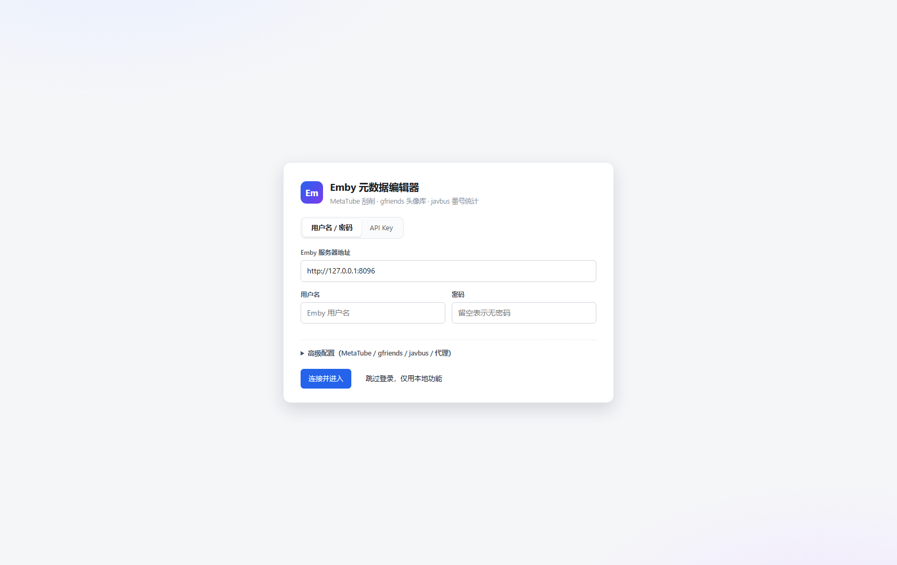
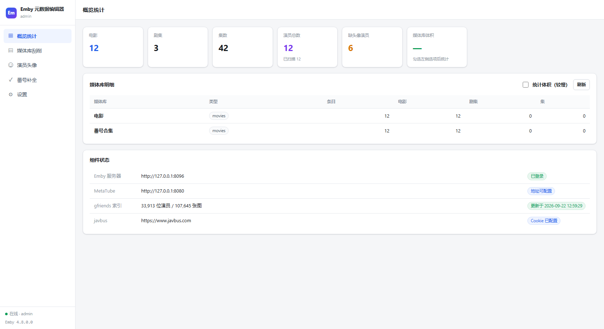
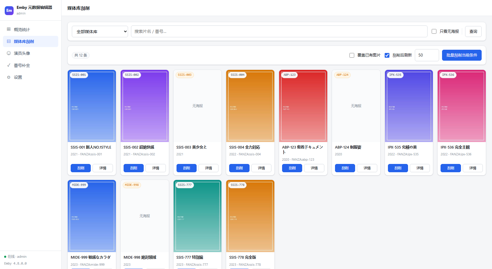
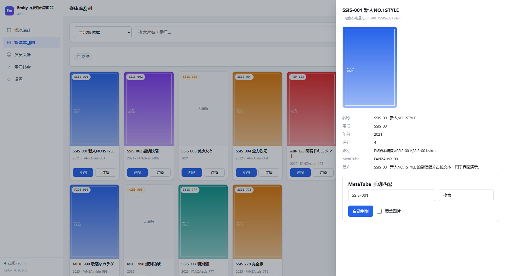
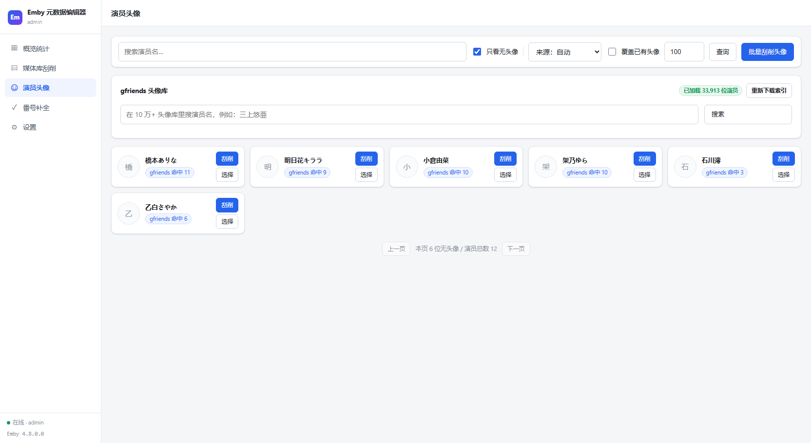
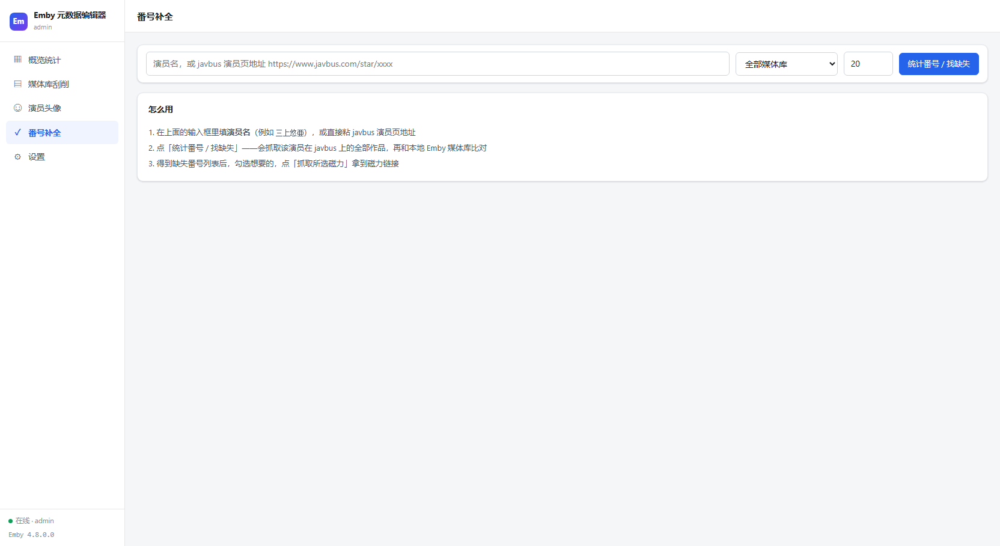
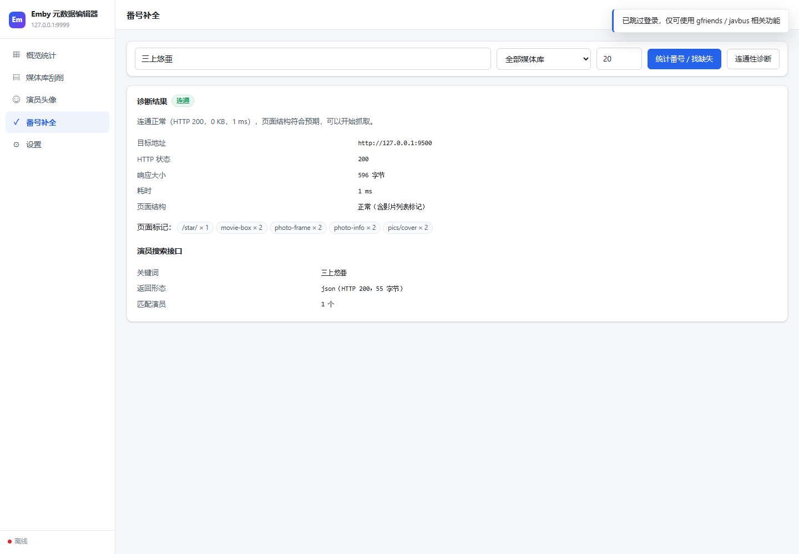
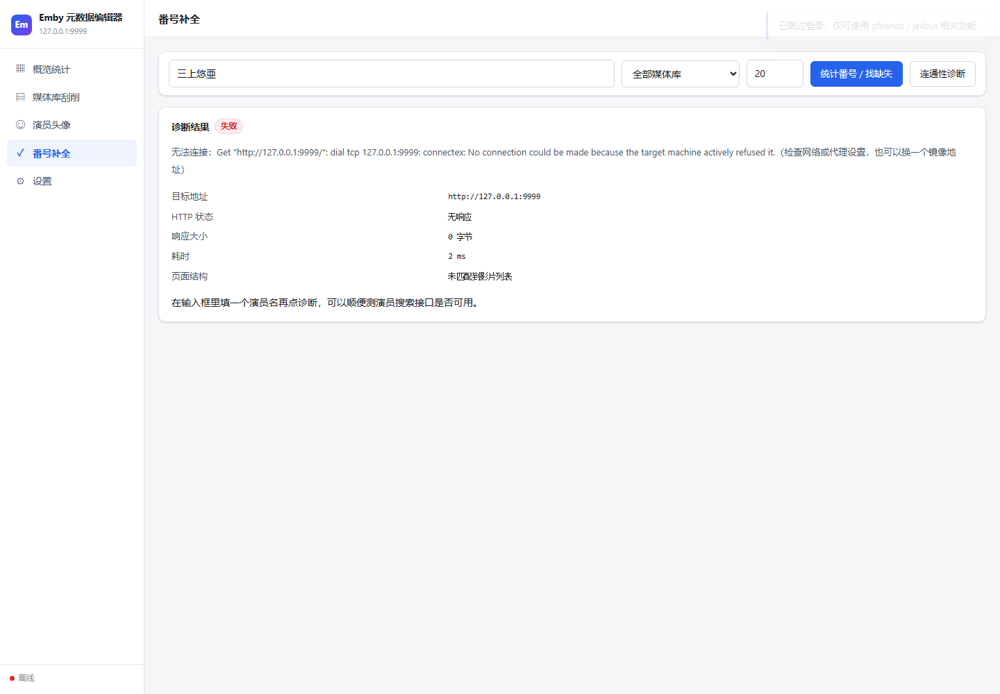
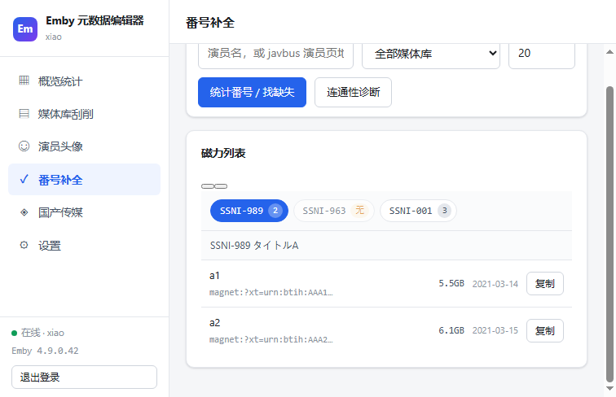

# Emby 元数据编辑器

一个用 Go 写的 Emby 媒体库管理工具。单文件 exe，双击即用，界面跑在本机浏览器里（默认只监听 `127.0.0.1`，不会暴露到局域网）。

> **下载** —— [最新版 `EmbyMetaEditor.exe`](https://github.com/huangmoling/EmbyMetaEditor/releases/latest/download/EmbyMetaEditor.exe)（Windows 64 位，约 8.3 MB，无需安装任何运行库）
>
> **Docker** —— [`aag111/emby-meta-editor`](https://hub.docker.com/r/aag111/emby-meta-editor)（linux/amd64 + arm64），一条命令起容器，见[「Docker 镜像」](#docker-镜像)。
>
> 不想下载也可以从源码构建，见[「从源码构建」](#从源码构建)。

围绕六件事：

| 模块 | 能力 |
|---|---|
| **Emby 登录** | 用户名 / 密码 或 API Key 两种方式，凭据本地保存 |
| **MetaTube 刮削** | 单个 / 批量刮削元数据与图片，**服务地址自行配置**（公共后端已下线，建议自建） |
| **gfriends 头像库** | 10 万+ 张头像索引；演员列表可**按媒体库筛选**，缺头像的一眼看完，单个挑或批量刮 |
| **javbus 番号统计** | 按演员抓取全部番号，与本地媒体库比对找出缺失，抓取磁力列表；**按番号并排分页**，磁力结果**带连通性诊断** |
| **国产传媒专项刮削** | 选媒体库 → 列出条目 → **单个刮削 / 勾选多个批量刮削 / 直接编辑元数据**；四站（xChina / 麻豆区 / 麻豆社 / 7mmtv）并发搜索，**封面 → 标题 → 标签 → 日期** 按优先级合并 |
| **媒体库统计** | 各媒体库条目数、电影 / 剧集 / 集数 |

---

## 快速开始

### 方式一：双击

直接双击 `EmbyMetaEditor.exe`，会自动打开浏览器进入控制台。

### 方式二：命令行

```bash
EmbyMetaEditor.exe                 # 默认 127.0.0.1:8097，自动开浏览器
EmbyMetaEditor.exe -port 8098      # 换端口
EmbyMetaEditor.exe -open=false     # 不自动开浏览器
EmbyMetaEditor.exe -dir D:\data    # 指定数据目录
EmbyMetaEditor.exe -host 0.0.0.0   # 允许局域网访问（默认不开，注意凭据安全）
```

首次启动会在程序目录生成 `config.json`（配置）和 `cache/`（gfriends 索引缓存，约 10 MB，下载一次可离线复用）。

### 方式三：Docker

本机或 NAS 上有 Docker / Docker Compose 的话，不用下载 exe，也不用源码：

```bash
docker run -d --name emby-meta-editor \
  -p 127.0.0.1:8097:8097 \
  -v emby-data:/data \
  aag111/emby-meta-editor:latest
```

起来后浏览器访问 `http://127.0.0.1:8097`，配置存在命名卷 `emby-data` 里的 `config.json`。
仓库里的 `docker-compose.yml` 是同一个东西的 compose 写法。

> 命令里的 `-p 127.0.0.1:8097:8097` 只把端口暴露给本机。**想去掉 `127.0.0.1:` 给局域网访问前想清楚**：
> 这个界面自身没有登录，谁打开都能操作、也能读到里面存着的 Emby 凭据。

### 使用顺序

1. **登录** —— 填 Emby 地址 + 用户名密码，或切到 API Key 模式。
   API Key 在 Emby 后台「高级 → API 密钥」里生成。
2. **概览统计** —— 看媒体库数量分布、缺头像演员数。
3. **媒体库刮削** —— 选媒体库、筛「只看无海报」、批量刮削；点单个卡片的「刮削」或「详情」可手动搜索匹配。
4. **演员头像** —— 先选媒体库（默认全部），默认只列出无头像的演员，点「刮削」单个处理，「批量刮削头像」按数量批量跑。
5. **番号补全** —— 填演员名（或 javbus 演员页地址），统计后得到缺失番号网格，勾选后抓磁力；磁力列表按番号并排分页，点标签切换查看。
6. **国产传媒** —— 先选媒体库再点「查询」，列出该库条目；每张卡可以**单独刮削**、**勾选后批量刮削**，或点「编辑」直接改名称 / 简介 / 日期 / 标签 / 类型。

---

## 配置项

全部可在界面「设置」里改，也可以直接编辑 `config.json`。

| 配置 | 默认值 | 说明 |
|---|---|---|
| `emby_url` | `http://127.0.0.1:8096` | Emby 服务器地址 |
| `metatube_url` | `http://127.0.0.1:8080` | MetaTube Server 地址，**必填自建实例** |
| `metatube_token` | 空 | MetaTube 实例开了鉴权时填写 |
| `gfriends_tree_url` | jsdelivr 上的 Filetree.json | 头像索引地址 |
| `gfriends_cdn` | jsdelivr 上的仓库根 | 头像图片前缀 |
| `javbus_url` | `https://www.javbus.com` | 可换成镜像站 |
| `javbus_cookie` | `age=verified; dv=1; existmag=mag` | javbus 的年龄验证 + 磁力开关 |
| `proxy` | 空 | HTTP 代理，留空则读系统环境变量 |
| `concurrency` | 4 | 批量任务并发数 |
| `javbus_interval_ms` | 1500 | javbus 请求间隔，别调太小 |
| `cn_sites` | 四个站点的官方地址 | 国产传媒专项刮削的站点地址表，可换镜像；留空项自动回落到默认 |
| `openai.base_url` | 空 | 翻译用的 OpenAI 接口地址（填到「接口根」即可，如 `https://api.openai.com/v1`） |
| `openai.api_key` | 空 | OpenAI / 中转的 API Key |
| `openai.model` | `gpt-4o-mini` | 翻译用的模型名 |
| `openai.enabled` | false | **翻译总开关**：关掉则刮削不调用翻译 |
| `insecure_tls` | false | 自签证书的 Emby 勾上 |

### 关于 MetaTube

官方公共后端已下线，需要自己跑一个：

```bash
docker run -d --name metatube -p 8080:8080 metatube/metatube-server:latest
```

装好后把 `metatube_url` 填成 `http://你的IP:8080`，在「设置 → MetaTube → 获取 provider 列表」点一下能列出 `FANZA / MGStage / DUMMY` 之类就算通了。

搜影片时**不指定 provider 更稳**：指定了会强制走那一个站点的抓取器，某个抓取器挂掉就是 500。不指定则由服务端并发查所有站点再聚合，实测同一个番号能同时拿到 `JavBus` / `JAV321` 两家的结果，按番号精确匹配取最合适的一条。

### 关于 Emby 的 API Key 登录

API Key 在 Emby 后台「高级 → API 密钥」生成，直接填进「设置 → API Key」即可。

注意：**API Key 是服务器级的，不绑定具体用户**。Emby 4.9.x 上用 API Key 请求 `/Users/Me` 会返回 500（`Unrecognized Guid format`），所以工具做了多级回退——先试 `/Users/Me`，不行就用已保存的 `user_id` 查 `/Users/{id}`，再不行列 `/Users` 挑一个。你只要在界面上正常登录过一次，身份就存下来了，之后一直能用。

### 关于 gfriends

`raw.githubusercontent.com` 在国内基本直连不了，所以默认走 jsdelivr CDN。索引文件有 6.5 MB，代码里带了三重备用地址（jsdelivr / gcore / fastly），换 CDN 不用重新下索引。

- **高清优先**：同一演员在库里往往有多张头像（不同分辨率），自动刮削时会先量每张的尺寸（宽 × 高），选最大的一张上传——对齐 Emby 自带 gfriends 插件的行为。
- **手动选择**：演员列表点「选择」可以看到所有候选头像，点哪张换哪张。选中后上传的就是你点的那张；如果那张在索引里已被移除，会明确报错提示重新搜索，不会静默换成第一张。

### 关于 javbus

- 站点需要 `age=verified` 之类的 Cookie 才给看内容，默认值已内置。
- 如果被 Cloudflare 拦（返回 403 + "Just a moment"），从浏览器 F12 里复制完整 Cookie（含 `cf_clearance`）粘进设置。
- 抓磁力要请求作品详情页 + 一个 ajax 接口，所以每个番号约 2 次请求，代码里默认限速 1.5 秒 / 次、并发 2。
- **抓不到东西时，先点「连通性诊断」。** 它会在输入框有内容时顺便测一次演员搜索接口。

#### 连通性诊断

javbus 这类站点出问题的原因有好几种，光看「抓取失败」分不出来。点一下诊断，它会把结论直接摊开：

| 现象 | 诊断给出的结论 |
|---|---|
| 域名解析不了 / 连接被拒 / 超时 | 无法连接 —— 检查网络或代理，也可以换个镜像地址 |
| HTTP 200 但**响应体是空的** | 被本机网络或运营商拦截了（这是国内最常见的形态） |
| 页面含 `Just a moment` / `cf-browser-verification` | 被 Cloudflare 拦了 —— 去浏览器复制含 `cf_clearance` 的完整 Cookie |
| 能连上但页面里没有影片列表标记 | 可能返回的是验证页或公告页，**原始页面已存到 `cache/debug/`** |
| 演员搜索接口返回空数组 | 站内没有这个演员名，换个写法或直接填演员页地址 |

诊断结果里还会列出 HTTP 状态、响应大小、耗时、以及页面上各结构标记（`movie-box` / `photo-frame` / `pics/cover` …）的出现次数。判断不了的时候，去 `cache/debug/` 打开落盘的原始 HTML 看看到底返回了什么 —— 比猜快得多。

也可以用命令行直接调：

```bash
curl "http://127.0.0.1:8097/api/javbus/probe"
curl "http://127.0.0.1:8097/api/javbus/probe?q=三上悠亜"
```

#### 封面图片为什么要走服务端

javbus 的图片按 **Referer 防盗链**：同一张封面，不带 Referer 返回 403，带 `Referer: https://www.javbus.com/` 返回 200，带 `Referer: http://127.0.0.1:8097/` 同样 403。所以浏览器从本机页面直接 `` 必然拿不到图，页面上就是一片空白。

页面里所有外部图片都走 `/api/img?u=<原始地址>`：

| 目标主机 | 行为 |
|---|---|
| 白名单（当前配置的 javbus / gfriends / 国产传媒站点主机 + `pics.dmm.co.jp`、`cdn.jsdelivr.net`、`i0.wp.com`、`upload.xchina.io` 等公开图床） | 服务端带正确 Referer / 浏览器 UA 代取，内存缓存 6 小时 |
| 其他公网图床 | 302 回原地址，浏览器直连 —— 效果与直连完全一致 |
| 内网地址、非 http(s) | 502 拒绝，避免这个接口变成 SSRF 跳板 |

「哪些图需要代取」的策略只写在服务端，所以你把 javbus 换成镜像域名时不用动前端。

> 国产传媒的封面必须走代理：`upload.xchina.io` 对**浏览器**返回 Cloudflare 挑战页（页面上表现为 `ERR_BLOCKED_BY_RESPONSE`，图片全白），而服务端带浏览器 UA 去取就是正常的 200。这类「接口通、页面白」的坑只能靠渲染层回归发现，见下面的 `verify_cn_view.py`。
>
> 白名单里以 `.` 开头的条目是**后缀匹配**（`.xchina.io` 同时匹配 `xchina.io` 和 `upload.xchina.io`），但不会匹配 `xchina.io.evil.com` 这种伪装域名。

```bash
curl -I "http://127.0.0.1:8097/api/img?u=https%3A%2F%2Fwww.javbus.com%2Fpics%2Fcover%2F83hf_b.jpg"
# HTTP/1.1 200 OK
# Content-Type: image/jpeg
# Cache-Control: public, max-age=21600
```

### 关于国产传媒专项刮削

欧美 / 日本番号有 MetaTube 兜底，国产传媒（麻豆、果冻、天美这类）基本没人做，只能去聚合站捞。工具内置四个站点的适配器，同一个番号**四站并发搜**，然后按字段优先级合并：

| 站点 | 搜索方式 | 特点 |
|---|---|---|
| **xChina**（`xchina.co`） | 服务端渲染的搜索页 | **命中率最高**，标题和你的库基本对得上；详情页有 Cloudflare，只取搜索页 |
| **麻豆区**（`madouqu.com`） | WordPress `?s=` | 字段最全（封面 / 标题 / 分类 / 演员 / 日期），但**搜索是模糊的**，必须自己过滤 |
| **麻豆社**（`madou.club`） | WordPress `?s=` | 偏 MDHG 系列，不含 91CM 系列（0 命中是正常的，不是故障） |
| **7mmtv**（`7mmtv.sx`） | 表单式搜索路径 | 国产番号覆盖一般，偶尔能补上别人没有的 |

**字段优先级：封面 → 标题 → 标签 → 日期。** 每个字段单独取值：谁先命中就用谁，互不干扰。四个字段固定全开，界面上不做勾选。

**只认精确匹配。** 麻豆区搜 `91CM-014` 会返回 `91CM074` / `91CM084` / `91CM094` 一堆近似结果，这些**一律丢弃**，不会当成命中写进你的库。番号比对走的是归一化后的 key（`91CM-014`、`91CM074`、`91CM-74` 都归一到同一形态再比），所以补零写法不同也能对上。

**先选媒体库再查询。** 国产传媒不会在整库上瞎跑 —— 库下拉里**没有**「全部媒体库」这个选项，选好库点「查询」才列出条目。这样既能避免把 `91CM-014` 往日本片库里套，也顺带把请求量压下来。

三种操作方式，都在列出的条目上直接做：

- **单个刮削** —— 卡片上的「刮削」，只处理这一条。
- **勾选多个批量刮削** —— 卡片右上角有勾选框，可以「全选本页」，再点「刮削选中」。勾选状态翻页不丢，任务跑完自动清空并刷新。
- **编辑元数据** —— 卡片上的「编辑」，改名称 / 原始标题 / 简介 / 发行日期 / 年份 / 标签 / 类型 / 分级。

编辑这块有个**刻意的限制**：只提交你改动过的字段。Emby 的 `POST /Items/{id}` 是整对象替换，把没碰过的字段一起发过去是要出事的。所以发行日期和年份**留空表示不修改**（不会清掉已有值），名称不能为空，标签 / 类型提交空数组才算清空。

标题的自动覆盖很保守：只有当前标题为空、等于番号、是个文件名、或者带下载站水印（`hhd800.com@…` 这类）时才覆盖，已经是像样片名的不动；要强制覆盖勾上「覆盖已有标题」。封面同理，默认已有封面就跳过，除非勾「覆盖已有封面」。

站点地址在「设置 → 国产传媒站点」里可以换成镜像，`config.json` 里对应 `cn_sites`。每站独立限速（默认 700ms / 次），批量任务会复用同一个限速器，不会因为并发把站点打挂。

想单独确认「某家站点认不认这个番号」，用只读接口：

```bash
curl "http://127.0.0.1:8097/api/cn/search?q=91CM-014"
```

---

### 关于翻译（OpenAI）

刮削番号（国产传媒 / MetaTube / javbus 路径）时，把**非中文的标题、简介**翻成简体中文，
方便在 Emby 里直接看中文名。

- **开关在「设置 → OpenAI / 翻译」**：填接口地址（官方 `https://api.openai.com/v1` 或任意兼容中转，
  如 `https://api.gptgod.online/v1`）、API Key、模型，再勾「启用翻译」即可。
- **兼容官方与各类中转**：代码只认 OpenAI 的 `chat/completions` 协议，地址里填「接口根」就行，
  拼路径（`/v1/chat/completions`）由程序自动处理。
- **只翻非中文**：含日文假名 / 韩文 / 纯英文的才翻；已经是中文的（或中日混排里带汉字的）不动，
  避免把中文片名再翻一遍。纯汉字的日文标题（没有假名）会被当成中文跳过——这类极少，
  且翻错比不翻更糟。
- **番号保留**：番号一般在标题最前面（`SSIS-001 xxx` / `91CM-014 xxx`），AI 翻译常把它一起翻掉。
  翻译前程序会把前导番号剥离，只翻其余部分，译完再原样拼回「番号 + 空格 + 译文」——
  番号永远完整保留。压制组 / 容器标记（HEVC10 / MP4 / CD1）不会被误当成番号。
- **标题保证带番号**：源标题本身不含番号时（纯日文标题、站点文案标题），
  刮削写入前会主动把识别出的番号补到标题最前面（`SSIS-001 中文标题`）；
  标题里已有该番号（任意常见写法，含 `SSIS001` / `ssis-1`）则不会重复添加。
  MetaTube 刮削与国产传媒刮削都生效，与是否开翻译无关。
- **缩略图一并刮削**：除了海报（Primary）和剧照（Backdrop），还会把 Emby 的
  **缩略图（Thumb，列表 / 横版视图用）** 一并刮进去——MetaTube 路径优先用横版剧照、
  没有就用封面；国产传媒路径复用封面。同样遵循「覆盖已有图片」开关。
- **原标题保留**：原标题是日文 / 韩文时，翻译写入标题的同时会把原文存进 Emby 的
  **OriginalTitle（原标题）字段**，Emby 里能同时看到中文标题与原始语言标题。
- **翻译失败不影响刮削**：接口超时 / 报错 / 没配 Key，一律静默退回原文，绝不阻断或拖慢刮削。
- 翻译是逐条调接口，批量任务里会跟着条目走；中转站有速率限制的话，慢一点是正常的。
- **连通性测试**：设置页填完接口地址 / Key / 模型后，点「**测试连接**」即可探测
  （地址可达 + Key 有效 + 模型可用）三项是否通过，结果实时显示在按钮右侧（绿=成功 / 红=失败 + 原因）。
  测试**不依赖**「启用翻译」开关，关着也能先测通再开；留空的字段会自动用已保存的配置。
  测试只发一次极小的对话请求（`max_tokens=1`），不写任何数据、不消耗翻译额度以外的东西。

---

## 界面

| 登录 | 概览统计 |
|---|---|
|  |  |

| 媒体库刮削 | 详情与手动匹配 |
|---|---|
|  |  |

| 演员头像 | 番号补全 |
|---|---|
|  |  |

| 连通性诊断 · 正常 | 连通性诊断 · 失败 |
|---|---|
|  |  |

| 磁力列表 · 按番号分页 | 国产传媒专项刮削 |
|---|---|
|  |  |

（截图里的数据来自本地 mock Emby / mock javbus，仅用于展示界面。）

---

## 从源码构建

```bash
go build -trimpath -buildvcs=false -ldflags "-s -w" -o EmbyMetaEditor.exe .
```

单文件 exe，前端资源（`web/`）和图标（`rsrc_windows_amd64.syso`）都通过 `go:embed` / PE 资源嵌进去了，拷走 exe 就能跑。

加了 `-buildvcs=false`，构建是**可复现**的：照着上面这条命令重建，得到的文件与仓库里那个 `EmbyMetaEditor.exe` 逐字节一致（md5 `82f8690085ef8794985976c5235c8350`）。
不加这个参数的话 Go 会往产物里嵌当前 commit 的 VCS 信息，体积和哈希都会变 —— 那是正常的，不是源码漂移。

跑测试：

```bash
go test ./...
```

123 个用例，覆盖番号归一化（含 `91CM-014` 这类数字开头番号、**以及「`.mp4` 被当成番号」这种误报**）、javbus 页面解析（含备用结构回退、裸 `<tr>` 片段、真实详情页片段）、连通性诊断的五种失败形态、MetaTube 字段兼容与 provider 结构兼容、Emby 用户身份解析的多级回退、图片代理的主机分类与缓存、演员按媒体库过滤、国产传媒四站解析与**只认精确匹配**的合并逻辑（含按勾选 id 批量、封面 raw→base64 回退上传）、**元数据编辑的「只提交改动项」语义**、以及用 mock Emby + mock MetaTube 跑通的完整刮削链路。

国产传媒的夹具是 `tools/extract_cn_fixtures.py` 从 `cache/debug/` 里落盘的**真实响应**里按容器标签逐字节切出来的，不手写 —— 手写夹具最容易「顺手把 `<tr>` 补成 `<table>`」，结果单测全绿、线上全挂。

其中 mock Emby 是**按真实 4.9 构建的行为建模**的，不是「理想 Emby」：读详情只认用户作用域路由（全局路径返回 404）、写操作只认全局路径、`POST /Items/{id}` 是整对象替换、图片上传只收 base64 文本、列表接口不返回 `SortName`、`/Persons` 支持 `ParentId` 但传非法 GUID 会 500。线上踩过的坑因此都能在单元测试里复现，而不是等上线才发现。

界面回归（可选）：起一个模拟 javbus 站点，用无头浏览器真实点击验证诊断按钮的渲染。

```bash
python tools/mock_javbus.py 9500 &          # 模拟 javbus
EmbyMetaEditor.exe -port 8097 -open=false & # 起应用
python tools/verify_javbus_probe.py         # 走 CDP 点击 + 截图 + 断言
```

实机冒烟（可选）：对真实 Emby / MetaTube / gfriends / javbus 跑一轮**只读**验证，逐项打印实测数字。

```bash
EmbyMetaEditor.exe -port 8097 -open=false &
python tools/smoke_real.py
```

前端静态自检（不打开浏览器，比对 HTML / JS / 后端路由）：

```bash
python tools/check_frontend.py
```

页面图片的**渲染**回归（需要无头 Edge + 真实 config.json）：

```bash
# 1) 起应用（真实配置）  2) 起无头 Edge
EmbyMetaEditor.exe -port 8097 -open=false &
"C:/Program Files (x86)/Microsoft/Edge/Application/msedge.exe" \
  --headless=new --disable-gpu --remote-debugging-port=9333 \
  --remote-allow-origins=* --user-data-dir=C:/Users/xiao/AppData/Local/Temp/edgeimg about:blank &
# 3) 跑验证
python tools/verify_images.py
```

它会真的点「统计番号」、等结果、**逐个 `scrollIntoView` 触发懒加载**，然后断言每张图的
`` 都走了服务端代理且 `naturalWidth > 0`，最后截图到 `screenshots/`。
覆盖三处：番号补全的缺失番号封面、MetaTube 搜索结果的封面、gfriends 头像库的缩略图。

演员按媒体库筛选的**交互**回归（同样需要无头 Edge + 真实 config.json）：

```bash
python tools/verify_person_lib.py
```

它会真实点击进入「演员头像」，记录「全部媒体库」的演员总数与卡片，
再逐个切换媒体库下拉，断言：分页说明里出现所选库名、该库演员数小于全局、
卡片确实换了一批人、能切回全部媒体库，且全程没有 console 报错。

> 「接口返回了 JPEG」和「页面上看得到图」是两件事，这个脚本验证的是后者。

磁力列表按番号分页的**渲染**回归：

```bash
python tools/verify_magnet_tabs.py
```

它会在注入的磁力数据上断言：每个番号一个标签、同时只有一个面板可见、空结果的番号标红、
点标签真的切到对应面板、「复制当前番号」复制的是当前标签而不是全部、重新渲染后选中项不丢，
以及没有数据时显示占位而不是空白。

国产传媒专项刮削的**渲染**回归（41 项）：

```bash
python tools/verify_cn_view.py
```

覆盖：导航项、旧界面（站点卡片 / 试运行 / 抓取字段勾选）确实被删掉、库下拉**没有**「全部媒体库」、
未选库时是提示态、选库点「查询」真的渲染出 24 张卡、每张卡有勾选框和「编辑」、
**封面真的渲染出来（`naturalWidth > 0`）**、勾选 / 全选 / 取消的计数与高亮、
**重新渲染后选中状态不丢**、「刮削选中」打到 `/api/cn/scrape-batch` 且 `ids` 就是勾的那几个、
单个「刮削」打到 `/api/cn/scrape`、编辑抽屉只把改动过的字段提交给 `/api/items/update`，
最后截图。

> 会写 Emby 的地方一律把 `api()` 换成假的：记录请求、POST 返回假结果、GET 转交真实实现。
> 既验到了交互，又零副作用。

> 统计图片前会先 `scrollIntoView()` —— `loading="lazy"` 的图在视口外永远是 pending，
> 不滚一遍就会误报「没图」。这正是发现「接口返回 200 但页面全白」那个 bug 的关键。

---

## Docker 镜像

已发布：**[`aag111/emby-meta-editor`](https://hub.docker.com/r/aag111/emby-meta-editor)**（公开，linux/amd64 + arm64，压缩后约 7.5 MB）

```bash
docker pull aag111/emby-meta-editor:latest
```

镜像定义在仓库根目录的 `Dockerfile`，两阶段构建：`golang:1.27-alpine` 里编译，
只把二进制搬到 `alpine:3.22`（外加 `ca-certificates` + `tzdata`）。

几个不显眼、但少一个就跑不起来的地方：

- **`CGO_ENABLED=0`** —— 产物是纯静态 ELF（实测无 `PT_INTERP` / `PT_DYNAMIC`），
  运行层不需要 glibc/musl，也不挑 libc 版本。
- **运行层必须装 `ca-certificates`** —— Emby / MetaTube / javbus / gfriends 全是 HTTPS，
  Go 在 Linux 上会去读 `/etc/ssl/certs/ca-certificates.crt`；这张表缺了**所有 TLS 请求都会证书校验失败**。
  只把静态二进制丢进 `scratch` 是能启动的，但一出网就挂，这是最容易被忽略的坑。
- **`-host 0.0.0.0` + `-open=false`** —— 只监听 `127.0.0.1` 的话端口映射进来的流量到不了；
  容器里也没有浏览器，别让它去调 `xdg-open`。这两条写在镜像的默认 `CMD` 里。
- **数据落在 `/data`**（`EMBYME_HOME`）—— `config.json` 与 `cache/` 都在卷里，容器重建不丢配置。
- **非 root（uid 1000）运行** —— 用宿主目录映射而不是命名卷时，先 `chown 1000:1000`。
- **`.dockerignore` 排掉了 `config.json` 与 `cache/`** —— 前者装着真实 Emby 令牌和 OpenAI key，
  绝不该进构建上下文。

本地构建（有 Docker 的机器上）：

```bash
docker build -t aag111/emby-meta-editor:latest .
docker run --rm -p 127.0.0.1:8097:8097 -v emby-data:/data aag111/emby-meta-editor:latest
```

### 发布到 Docker Hub

`.github/workflows/docker.yml` 在**打 `v*` tag 时**自动构建 `linux/amd64` + `linux/arm64`
并推送到 Docker Hub；也可以在 Actions 页面手动触发（改完 Dockerfile 想先验一次，不用等发版）。

首次使用需要配两个 secret（Settings → Secrets and variables → Actions）：

| Secret | 值 |
|---|---|
| `DOCKERHUB_USERNAME` | Docker Hub 用户名 |
| `DOCKERHUB_TOKEN` | 访问令牌（Account Settings → Personal access tokens，权限 **Read & Write**） |

配好后打 tag 即发布：

```bash
git tag v1.0.8 && git push origin v1.0.8
```

镜像标签由 tag 推导：`v1.0.8` → `1.0.8` / `1.0` / `1` / `latest`（`latest` 始终跟着最新正式版）。
手动触发（`workflow_dispatch`）没有 tag 可比，只会推 `latest`。
镜像名固定为 `<DOCKERHUB_USERNAME>/emby-meta-editor`，第一次推送时 Docker Hub 会自动创建仓库
（公开仓库，匿名即可拉取）—— 所以 Docker Hub 的用户名改起来只动 secret，不用改代码；
README 与 `docker-compose.yml` 里写死的 `aag111/` 换用户名时一并替换即可。

> **注意**：Docker Hub 用户名（`aag111`）和 GitHub 用户名（`huangmoling`）不是同一个，
> 别照搬 GitHub 名去写镜像地址。

---

## 目录结构

```
main.go              启动、参数、控制台 UTF-8、自动开浏览器
config.go            配置结构与持久化
api.go               HTTP 路由与处理函数
emby.go              Emby REST 客户端
imageproxy.go        图片代理：Referer 防盗链、白名单、6 小时缓存
metatube.go          MetaTube v1 客户端
gfriends.go          gfriends 索引下载 / 缓存 / 查询
javbus.go            javbus 抓取、HTML 解析、连通性诊断
cnmedia.go           国产传媒四站抓取、番号归一化、精确匹配合并
scrape.go            刮削编排、番号比对
jobs.go              后台任务与进度
util.go              番号归一化、HTML 辅助、HTTP 客户端
console_windows.go   Windows 控制台切 UTF-8
web/                 前端（原生 JS，无构建步骤）
tools/               验证脚本：模拟站点 / CDP 界面回归 / 前端自检 / 封面渲染 / 演员按库筛选 / 磁力分页 / 国产传媒 / 夹具切取 / 实机冒烟
app.ico              图标源文件
Dockerfile           Docker 镜像定义（两阶段，静态链接）
.dockerignore        排除 config.json / cache 等，别把凭据带进构建上下文
docker-compose.yml   拉镜像运行的 compose 写法
.github/workflows/docker.yml  打 tag 自动构建并推送 Docker Hub
```

验证脚本一览：

| 脚本 | 验什么 | 需要什么 |
|---|---|---|
| `check_frontend.py` | HTML / JS / 后端路由静态对照 | 无 |
| `smoke_real.py` | 真实环境只读冒烟 41 项（含国产传媒四站搜索 / 批量 dry-run / 封面代理） | 起 exe + 真实 config |
| `verify_images.py` | 页面图片**真的渲染出来**（番号补全 / MetaTube 搜索 / gfriends 三处） | 起 exe + 无头 Edge |
| `verify_person_lib.py` | 演员按媒体库筛选的**交互**（切库、总数、卡片换批、切回） | 起 exe + 无头 Edge |
| `verify_magnet_tabs.py` | 磁力列表**按番号分页**（标签切换、复制当前 / 全部、空态） | 起 exe + 无头 Edge |
| `verify_cn_view.py` | 国产传媒**选库→列表→单选/多选刮削→编辑元数据**（41 项，写路径全用假 `api()`） | 起 exe + 无头 Edge |
| `extract_cn_fixtures.py` | 从 `cache/debug/` 的原始响应里切测试夹具 | 落盘的原始 HTML |
| `mock_javbus.py` + `verify_javbus_probe.py` | 模拟站点 + 诊断按钮的界面交互 | 起 exe + 无头 Edge |
| `live_test.go`（`EMBY_LIVE=1 go test -run TestLive`） | 实机**写**路径，幂等不改变数据 | 真实 config |

---

## 已知边界

- 刮削只处理 `Movie` 类型条目；剧集 / 分集不在范围内。
- 番号识别靠正则从片名和路径里提取，路径里带番号是最稳的。国产传媒那类**数字开头**的番号（`91CM-014`、`91BCM-002`、`18BT.NET-…`）走的是单独的提取逻辑，见下面踩坑表。
- javbus 页面结构如果改版，解析可能失效 —— `parseStarPage` / `parseMagnets` 已有单元测试夹具，改起来很快。真改版了先跑「连通性诊断」，看 `cache/debug/` 里的原始页面就知道新结构长什么样。
- javbus 有反爬。限速默认 1.5 秒 / 次、并发 2，别调太激进。
- 工具默认只监听本机。用 `-host 0.0.0.0` 开放出去等于把 Emby 凭据摊在网上，自己掂量。
- `SortName` / `ForcedSortName` 在部分 Emby 构建上设不进去，详见下面「一个改不回来的字段」。
- 国产传媒四站都是第三方聚合站，改版会让解析失效。每站一个 `parseXxx` 函数、夹具在 `testdata/cn/`（由 `tools/extract_cn_fixtures.py` 从真实响应里切），改起来比读代码快。站点挂了不会让整次刮削失败 —— 失败原因会写在那一站的卡片里，其余站点照常出结果。
- 麻豆区的搜索是**模糊**的，返回近似番号是常态；工具只认精确匹配，所以「搜了但没命中」通常是正常的，不代表站点挂了。要判断站点是否可达，看那一站的 `OK` / `Error` 字段。
- `xchina.co` 的**详情页有 Cloudflare 保护**（403），工具只取搜索页，不去碰详情页。
- 编辑元数据时**发行日期和年份留空表示不修改**，不会清掉已有值 —— Emby 的 `POST /Items/{id}` 是整对象替换，发空日期要么 400 要么把日期抹掉，两种都不能接受。要清空请直接在 Emby 里改。名称不能为空；标签 / 类型提交空数组才算清空。
- 这个 Emby 构建（4.9.0.42）的详情接口**不返回 `Tags`**（实测恒为 `null`），标签只体现在 `TagItems` 里。工具写的时候仍然发 `Tags`（服务端认这个字段），编辑框读的时候会同时看 `Tags` 和 `TagItems`。如果你改完标签没看到变化，多半是这个构建没把 `Tags` 回显出来。
- 封面代理只放行白名单主机。要加自己的图床，改 `imageproxy.go` 里的 `imageCDNHosts`（以 `.` 开头表示后缀匹配）。
- **演员列表的内容取决于你的 Emby 数据。** `/Persons` 返回的是 Emby 索引为 `Person` 的条目，
  有些刮削器会把**片商 / 系列名**也写进条目的 `People` 字段，于是它们会以「演员」身份出现
  （例如某些 JAV 库里的 `プレミアムビデオ`、`ハメンタリズム` 这类）。工具只如实展示，
  不猜哪些是真人 —— 想只看某个库的演员，用「演员头像」页的媒体库下拉缩小范围。

---

## 踩过的坑（都已在代码里修掉）

记在这里，是因为它们都属于「照文档写就会错」的类型：

| 现象 | 根因 | 处理 |
|---|---|---|
| Emby 报 `token_valid: false`，但媒体库明明能列出 | `/Users/Me` 在 Emby 4.9.x 上用 API Key 调会 500（`Unrecognized Guid format`）——该令牌没有关联用户 | `Emby.Me` 改为多级回退：`/Users/Me` → `/Users/{已知id}` → `/Users` 列表 |
| 媒体库刮削 / 点详情报 `404 找不到文件 "/Items/513232"` | 这个构建**只注册了用户作用域的详情路由**，`GET /Items/{id}` 会落到静态文件处理器。反过来写操作（`POST /Items/{id}`、`/Refresh`、`DELETE …/Images/…`）**只有全局路径存在** | `ItemDetail` 先试 `/Users/{uid}/Items/{id}` 再退回全局；写操作保持全局路径 |
| 刮削后条目简介、年份、评分全没了 | `POST /Items/{id}` 是**整对象替换**而不是部分更新——body 里没带的字段会被清空 | `UpdateItem` 以**当前完整 DTO** 为底再叠加 patch；只排除 `Etag`/`MediaSources`/`MediaStreams`/`Chapters` 这类服务端派生的大字段 |
| 更新报 `400 Value cannot be null. (Parameter 'source')` | body 里缺 `ProviderIds`（或为 `null`）时服务端直接拒绝 | `UpdateItem` 始终回填一个非 nil 的 `ProviderIds`，并与已有外部 ID 合并 |
| 上传头像报 `500 The input is not a valid Base-64 string…` | 这个构建的 `POST /Items/{id}/Images/{Primary}` 要的是 **base64 文本** body，标准 Emby 要的是原始字节 | 先发原始字节，命中 base64 报错再换格式重试。**顺序不能反**——标准服务器上 base64 文本会被当成图片数据静默存进去 |
| 上传图片报 `400 Unable to determine image file extension from mime type` | 服务端用 Content-Type 决定存盘扩展名 | `normalizeImageType` 归一化 MIME，缺失时按文件头猜；认不出是图片就本地报错，不发请求 |
| 缺失番号列表里封面全是空白 | javbus 图片的 Referer 防盗链（详见上一节） | 服务端 `/api/img` 代理 + 6 小时缓存 |
| 媒体库卡片的角标显示的是年份，不是番号 | **Emby 的 `/Items` 列表接口不返回 `SortName`**（实测全是 `null`，详情接口才返回），前端拿它当番号永远拿不到值 | 番号改由服务端算：`itemNumber()` 复用刮削那套归一化，`/api/items` 与 `/api/items/detail` 都回填 `Number` |
| javbus 磁力永远「暂无链接」，但接口明明有数据 | ajax 返回的是**裸 `<tr>` 片段**，HTML5 树构造会把游离的 `<tr>` 直接丢弃 | `parseMagnets` 先套一层 `<table><tbody>` 再解析 |
| MetaTube 报「解析 providers 失败」 | v1 实际返回 `{"data":{"movie_providers":{…}}}`，不是文档里的扁平数组 | 三种结构都兼容 |
| 刮削后制作商 / 简介为空 | 实际字段名是 `maker` / `summary`，代码里写的是 `studio` / `plot` | 两套都留，取值用 `firstNonEmpty` 兜底 |
| 番号统计偶发抓不到演员 | 搜索接口有时返回 JSON、有时返回 HTML | 两种都解析，且失败时落盘原始响应 |
| 按媒体库查演员，库 ID 写错时整个请求 500 | `/Persons` 的 `ParentId` 不是 GUID 时 Emby 直接 500 `Unrecognized Guid format.`，**不是**返回空列表；而全零 GUID 这种「格式合法但不存在」的会正常返回 0 条 | 前端只传真实库 Id 或空串，两种都安全；mock 也照抄了这个 500 行为，避免以后误传坏 ID 时单测看不出来 |
| 国产传媒条目的角标显示 `CM-014`，不是 `91CM-014` | 通用番号正则要求「字母前缀 + 数字」，数字开头的番号被当成噪声前缀截掉了。**影响面比想象中大** —— 角标、写入的 `Tags`、搜索关键词全都用的是它 | `itemNumber()` 先跑国产传媒专用的 `cnExtractNumber`（允许 0–4 位数字前缀），命中且前缀更长时优先返回；同时把 `HEVC10 1080P` 这类压制组标记加进噪声前缀表过滤掉 |
| 国产传媒封面在页面上全是白框，但 `/api/img` 明明返回 200 | `upload.xchina.io` 对**浏览器**返回 Cloudflare 挑战页（页面报 `ERR_BLOCKED_BY_RESPONSE.NotSameOrigin`），而服务端带浏览器 UA 去取就是正常图片 | 把国产传媒的图床加进 `imageproxy.go` 的代理白名单，浏览器只跟本机 `/api/img` 打交道 |
| 修完「数字开头番号」之后，**每个 mp4 条目都多出一个「番号 `MP-4`」** | 为了支持 `91CM-014` 放宽了正则（允许数字前缀、数字部分只要求 1 位），结果 `.mp4` 被拆成 `MP` + `4`。角标、写进 `Tags` 的内容、javbus 搜索关键词全跟着错 —— 修之前抽样 200 条「有番号」的有 196 条 | `numberSourceFields()` 抽番号前先抹掉文件扩展名（`reFileExt`），并把 `MP` / `CD` 这类容器 / 分卷标记加进 `cnNoisePrefix`。回归用例 `TestCNItemNumberIgnoresFileExtension` 守着 |

### 一个改不回来的字段

`SortName` / `ForcedSortName` 在这个 Emby 构建（4.9.0.42）上**无法通过 API 设置**。实测三种 payload 形态、只发 `ForcedSortName`、以及 `/Items/{id}/Metadata` 端点，全部无效（POST 返回 204 但服务端总是按 `Name` 重新计算）。条目本身没有锁定（`LockedFields` 为空）。

好在原始日文标题同时存在于 `OriginalTitle` 字段里，没有真的丢。刮削时也就没必要再往 patch 里塞这两个字段了。

MIT License.
