# Emby 元数据编辑器

Go 写的 Emby 媒体库元数据编辑器。**单文件 exe + 内嵌 Web UI**（`web/` 原生 JS，无构建步骤，`go:embed` 进二进制），双击即用，界面跑在本机浏览器里（默认只听 `127.0.0.1`）。

> 界面自带**访问认证**（单密码登录，PBKDF2 派生、内存会话），与 Emby 登录是两回事 —— 所以把端口开到局域网也不等于把管理员权限摊在网上。见[访问认证](#访问认证)。
>
> 下载：[`EmbyMetaEditor.exe`](https://github.com/huangmoling/EmbyMetaEditor/releases/latest/download/EmbyMetaEditor.exe)（Windows x64，约 8.9 MB，无运行库依赖）
> Docker：[`aag111/emby-meta-editor`](https://hub.docker.com/r/aag111/emby-meta-editor)（linux/amd64 + arm64）

| 模块 | 说明 |
|---|---|
| **访问认证** | 保护界面本身：单密码、PBKDF2-SHA256 存储、按 IP 退避 |
| **Emby 登录** | 用户名密码 / API Key 两种，凭据本地保存 |
| **MetaTube 刮削** | 单个 / 批量刮元数据与图片（公共后端已下线，**自建必填**） |
| **gfriends 头像** | 10 万+ 头像索引；人物列表按**媒体库 + 人物类型（演员 / 导演）**筛；选图弹窗标出**像素尺寸与文件体积**；索引与图片各带两层 CDN 容错 |
| **演员资料** | 简介 / 出生日期 / 出生年份 / 出生地 / 外部 ID（三源合并、**抓取源分列可选**），并列出该人物在本库的作品；**打开面板不联网**，写入默认「只填空白」、单卡可勾选覆盖、可回滚 |
| **番号补全** | 按演员抓全部番号 → 与本地库比对找缺失 → 抓磁力列表（**按体积倒序**、**按番号并排分页**、带连通性诊断） |
| **国产传媒** | 选库列条目 → 单个 / 勾选批量刮削 / 直接编辑元数据；四站并发按 **封面 → 标题 → 标签 → 日期** 合并 |
| **翻译** | 刮削时把非中文标题 / 简介翻成简体中文（OpenAI 兼容接口，可选） |
| **媒体库统计** | 各库条目数、电影 / 剧集 / 集数 |

---

## 快速开始

```bash
EmbyMetaEditor.exe                 # 默认 127.0.0.1:8097，自动开浏览器
EmbyMetaEditor.exe -port 8098      # 换端口
EmbyMetaEditor.exe -open=false     # 不自动开浏览器
EmbyMetaEditor.exe -dir D:\data    # 指定数据目录（默认程序目录）
EmbyMetaEditor.exe -host 0.0.0.0   # 允许局域网访问（凭据安全见下）
```

首次启动在数据目录生成 `config.json` 与 `cache/`（gfriends 索引约 10 MB，下过一次可离线复用），并生成一个**随机访问密码打印到控制台**。忘了密码就用环境变量重设（这是唯一的找回入口）：

```bash
EMBYME_AUTH_USER=admin EMBYME_AUTH_PASSWORD=新密码 EmbyMetaEditor.exe
# PowerShell: $env:EMBYME_AUTH_PASSWORD="新密码"; .\EmbyMetaEditor.exe
```

Docker：

```bash
docker run -d --name emby-meta-editor -p 8097:8097 \
  -e EMBYME_AUTH_USER=admin -e EMBYME_AUTH_PASSWORD=换成你自己的密码 \
  -v emby-data:/data aag111/emby-meta-editor:latest
```

配置存在命名卷 `emby-data` 里的 `config.json`。不传 `EMBYME_AUTH_PASSWORD` 也能起（随机密码打到 `docker logs`）。容器只跑 http，cookie 带不了 `Secure` —— **要暴露到公网必须在前面套 HTTPS 反代**，且反代要保持 `Host` 与浏览器一致，否则写请求会被同源校验拒掉。

---

## 配置

界面「设置」里可改，也可直接编辑 `config.json`。

| 配置 | 默认值 | 说明 |
|---|---|---|
| `emby_url` | `http://127.0.0.1:8096` | Emby 服务器地址 |
| `metatube_url` | `http://127.0.0.1:8080` | MetaTube Server，**必填自建实例** |
| `metatube_token` | 空 | MetaTube 实例开了鉴权时填写 |
| `gfriends_tree_url` | jsdelivr 上的 `Filetree.json` | 头像索引地址 |
| `gfriends_cdn` | jsdelivr 上的仓库根 | 头像图片前缀 |
| `javbus_url` | `https://www.javbus.com` | 可换镜像站 |
| `javbus_cookie` | `age=verified; dv=1; existmag=mag` | 年龄验证 + 磁力开关 |
| `proxy` | 空 | HTTP 代理，留空则读系统环境变量 |
| `concurrency` | 4 | 批量任务并发数 |
| `javbus_interval_ms` | 1500 | javbus 请求间隔，别调太小 |
| `cn_sites` | 四站官方地址 | 国产传媒站点表，可换镜像；留空项回落默认 |
| `openai.base_url` | 空 | 翻译用接口**根**地址（如 `https://api.openai.com/v1`） |
| `openai.api_key` | 空 | OpenAI / 中转的 Key |
| `openai.model` | `gpt-4o-mini` | 翻译模型 |
| `openai.enabled` | false | 翻译总开关 |
| `insecure_tls` | false | 自签证书的 Emby 勾上 |
| `auth.username` | `admin` | 界面访问用户名 |
| `auth.password_hash` | 首启生成 | PBKDF2 派生值，**不存明文**；改这里没用，重设见上 |
| `auth.password_generated` | true | 是否仍是首启生成的密码（界面据此提示「建议改掉」） |

---

## 访问认证

与 Emby 登录无关，只解决「谁能打开这个界面」。密码来源优先级：`EMBYME_AUTH_PASSWORD` > `config.json` 的哈希 > 首启生成并打印。

- **PBKDF2-SHA256**（20 万轮 + 16 字节随机盐），常量时间比较 —— `config.json` 被备份 / 贴出来都不泄密。
- 会话是**内存里**的 32 字节随机令牌，不落盘：进程重启 = 全部登出。代价是容器重启要重新登录。
- Cookie `HttpOnly` + `SameSite=Lax`；进程默认明文 HTTP，故**不加 `Secure`**，上公网靠反代。
- 写请求校验 `Origin` / `Referer`，且只收 JSON（HTML 表单伪造不出 `application/json`）—— CSRF 第二道闸。
- 登录失败按 IP 退避：前两次不罚，之后 3s → 10s → 30s → 2min → 5min → 15min。
- 改密码要验旧密码，改完**踢掉其他所有会话**。
- **敏感项不下发到页面**（Emby 密码 / API Key、MetaTube token、javbus cookie、OpenAI key），设置页显示「已保存，留空则不修改」—— **留空提交 = 不修改**。要清空就编辑 `config.json`。
- 副作用：Emby 海报 / 头像改由服务端带令牌代取（`/api/emby/image`），令牌不进 ``，顺带解决「页面 http、Emby https 自签」被拦的问题。
- **CSP：`connect-src 'self'`（严）+ `img-src 'self' data: blob: http: https:`（宽）**。`img-src` 放开的唯一原因是让 javbus 页面自己的脚本能把磁力预览图注入进来（见[踩过的坑](#踩过的坑)）。代价是自家模板里的外链 `` 不再被浏览器拦，这条守卫改由 `tools/check_frontend.py` 静态扫守。

---

## 图片代理

javbus 图片按 **Referer 防盗链**：不带 Referer 403，带 `Referer: https://www.javbus.com/` 200，带本机 origin 也是 403 —— 浏览器直连必然白板。所以页面里所有外部图片走 `/api/img?u=<原始地址>`：

| 目标主机 | 行为 |
|---|---|
| 白名单（配置的 javbus / gfriends / 国产传媒站点主机 + `pics.dmm.co.jp`、`cdn.jsdelivr.net`、`i0.wp.com`、`upload.xchina.io` 等） | 服务端带正确 Referer / 浏览器 UA 代取，内存缓存 6 小时 |
| 其他公网图床 | 302 回原地址，浏览器直连（效果与直连一致） |
| 内网地址、非 http(s) | 502 拒绝，避免变成 SSRF 跳板 |

白名单以 `.` 开头是**后缀匹配**（`.xchina.io` 匹配 `xchina.io` 与 `upload.xchina.io`，不匹配 `xchina.io.evil.com`）。加自己的图床改 `imageproxy.go` 的 `imageCDNHosts`。策略只在服务端，换 javbus 镜像域名不用动前端。

> `upload.xchina.io` 对**浏览器**返回 Cloudflare 挑战页（`ERR_BLOCKED_BY_RESPONSE`，图片全白），服务端带浏览器 UA 却是正常 200 —— 这类「接口通、页面白」的坑只能靠渲染层回归发现。

---

## 各模块要点

### MetaTube

公共后端已下线，自建：

```bash
docker run -d --name metatube -p 8080:8080 metatube/metatube-server:latest
```

`metatube_url` 填 `http://你的IP:8080`，「设置 → MetaTube → 获取 provider 列表」能列出 `FANZA / MGStage / DUMMY` 就算通。搜片**不指定 provider 更稳**：指定就强制走那一个抓取器，抓取器一挂就是 500；不指定则服务端并发聚合，按番号精确匹配取最合适的一条。

### Emby API Key 登录

API Key 在 Emby 后台「高级 → API 密钥」生成。**它是服务器级的、不绑定用户**：4.9.x 上用 API Key 请求 `/Users/Me` 会 500（`Unrecognized Guid format`），所以 `Emby.Me` 做多级回退 —— `/Users/Me` → 已保存的 `user_id` 查 `/Users/{id}` → 列 `/Users` 挑一个。只要正常登录过一次，身份就存下来了。

### gfriends

`raw.githubusercontent.com` 国内基本直连不了，默认走 jsdelivr。索引 6.5 MB，带**两层备用地址**（换 CDN 不用重下索引）：

| 故障面 | 备用 |
|---|---|
| **仓库** | `gfriends/gfriends` → `xinxin8816/gfriends`（内容一致镜像） |
| **CDN 节点** | `cdn.jsdelivr.net` → `gcore.` / `fastly.` → `raw.githubusercontent.com`（不同基础设施） |

**索引与图片都走这套列表**（只兜索引等于没兜：索引下得回来、图全失败，功能照样整体不可用）。图片回落只在**主基址一张都没取下来**时触发，正常网络零额外请求；备用基址单次上限 30 秒。自定义镜像站**不追加**这些外网地址。

- **高清优先**：自动刮削会先量每张候选的宽 × 高，选最大的一张（对齐 Emby 官方 gfriends 插件）。
- **手动选图**：每张候选下标出 `640×960 · 130 KB` —— 候选常是一堆同名图、缩略图都缩到 88px，光看图分不出原图与压缩图，这两个数才是依据。数据由 `POST /api/img/info` 服务端代取（浏览器读不到 `` 字节数，跨域 `fetch` 又被 `connect-src 'self'` 挡着），顺带写进图片缓存所以缩略图秒开。选中的那张若已被索引移除会明确报错，不会静默换成第一张；客户端传回的地址**只用于定位是哪一张**，实际下载永远走服务端配置的基址。

### 演员资料 / 人物列表

「演员头像」页每张卡还能抓**人物本人的资料**（简介 / 出生日期 / 出生年份 / 出生地 / 外部 ID），并列出其在媒体库里的作品。

| 源 | 取什么 |
|---|---|
| **AVデータバンク**（`av-db.net`） | 字段最全：生年月日 / 出身地 / 身长・三围 / 血型 / 爱好 / 事务所 / 别名 / 标签，也是外部 ID（`avdb`）来源 |
| **AV-League**（`av-league.com`） | 生年月日 / 出身地 / 三围 / 事务所，用于互相印证 |
| **Wikipedia（日文）** | 简介段落 |

- **抓取是显式动作**：点「资料」只开面板，立刻给出**本地**能拿到的两样 —— 分列的源（每源写明会填哪些字段，顺序即优先级）与作品列表。要抓才点「抓取资料」（一次要并发访问三个站）。侧栏那组源开关与面板里这组是**同一份状态**。
- **写入策略**：默认**只填空白**；Emby 已有值且本次也抓到的默认跳过，**手动勾上即变成「将覆盖原值」**（按钮改文案 + 危险色）。**批量路径永远只填空白** —— 唯一能改已有值的入口是单卡面板上亲手勾的字段。写前留快照，「同步历史」可逐字段回滚（**点两次**才执行）。
- 姓名走**两轮匹配 + 详情页确认**（`minMatchScore`=80 / `minDetailMatchScore`=95）避免同名不同人；别名记忆在 `cache/actor_aliases.json`。
- **标签不写 Emby 的 `Tags`**，而是并进简介最后一行 —— 这个构建对 `Person` 的 `Tags` 收下不保存，写了会「看起来成功、实际没有」还覆盖用户自己的标签。
- 作品列表按 `PremiereDate` 倒序，库名由 `GET /Library/VirtualFolders` 的路径匹配条目 `Path` 得出（`Views` 接口**不返回 `Path`**，靠它拿不到库名），一屏 400 条，更多点「再加载」。

**人物类型筛选**（v1.4.0）走 Emby 的 `PersonTypes`，下拉：演员 + 导演（默认）/ 仅演员 / 仅导演 / 全部人物（含片商）。`personTypesParam()` 归一化（空 → 默认、`all` → 空串、`Actor,Bogus` 只留合法项、全非法 → 默认），下发到 `/api/persons?types=` 与两个批量接口的 `person_types`。

> 两个实测出来的限制：**片商名在 Emby 里就是 `Actor`，按类型筛不掉**（全量 10561 / Actor 9497 / Director 1189 / Actor,Director 10559）；返回条目的 `Type` 恒为 `Person`，「是演员还是导演」**只存在于查询参数里**。

### javbus

- 站点要 `age=verified` 之类 Cookie，默认值已内置；被 Cloudflare 拦（403 + `Just a moment`）就从 F12 复制含 `cf_clearance` 的完整 Cookie 进设置。
- 抓磁力 = 详情页 + 一个 ajax，每番号约 2 次请求，默认限速 1.5 秒 / 次、并发 2。
- 磁力**按体积从大到小排序**（`1.83GB` / `2.57 GB` 直接比字符串是错的，先换算字节；解析不出体积的排最后，同体积保持原顺序）。
- 每行磁力是**完整** `<a href>`（不截断，长地址靠 CSS 省略）—— 点它可交给下载工具，也能让 javbus 页面脚本弹预览图。旁边「复制」在**非安全上下文**（`http://` + 局域网 IP，即 Docker 的访问方式）没有 `navigator.clipboard`，会回退 `execCommand`，所以 exe 与 Docker 都能复制。
- 番号补全只列**缺失番号**（「本地有、javbus 未列出」不再单独成块）。

**连通性诊断**：抓不到东西时先点它，结论直接摊开。

| 现象 | 结论 |
|---|---|
| 域名解析不了 / 连不上 / 超时 | 无法连接 —— 查网络或代理，或换镜像 |
| HTTP 200 但**响应体为空** | 被本机网络或运营商拦截（国内最常见） |
| 页面含 `Just a moment` / `cf-browser-verification` | 被 Cloudflare 拦 —— 复制含 `cf_clearance` 的 Cookie |
| 连上但页面没有影片列表标记 | 可能返回验证页 / 公告页，**原始页面已存 `cache/debug/`** |
| 演员搜索返回空数组 | 站内没这个演员名，换个写法或直接填演员页地址 |

结果里还会列 HTTP 状态、响应大小、耗时、各结构标记（`movie-box` / `photo-frame` / `pics/cover` …）出现次数。命令行同样可用：

```bash
curl "http://127.0.0.1:8097/api/javbus/probe"
curl "http://127.0.0.1:8097/api/javbus/probe?q=三上悠亜"
```

### 国产传媒

欧美 / 日本番号有 MetaTube 兜底，国产传媒（麻豆、果冻、天美这类）只能去聚合站捞。内置四站适配器，同一番号**四站并发搜**后按字段优先级合并：

| 站点 | 搜索方式 | 特点 |
|---|---|---|
| **xChina**（`xchina.co`） | 服务端渲染搜索页 | 命中率最高，标题基本对得上；详情页有 Cloudflare，只取搜索页 |
| **麻豆区**（`madouqu.com`） | WordPress `?s=` | 字段最全，但**搜索是模糊的**，必须自己过滤 |
| **麻豆社**（`madou.club`） | WordPress `?s=` | 偏 MDHG 系列，不含 91CM（0 命中正常） |
| **7mmtv**（`7mmtv.sx`） | 表单式搜索路径 | 覆盖一般，偶尔补上别人没有的 |

- **字段优先级：封面 → 标题 → 标签 → 日期**，每字段单独取值、互不干扰，四个字段固定全开。
- **只认精确匹配**：搜 `91CM-014` 会返回 `91CM074` / `91CM084` 一堆近似结果，**一律丢弃**。比对走归一化后的 key（`91CM-014` / `91CM074` / `91CM-74` 归一到同一形态）。
- **先选库再查询**：库下拉**没有**「全部媒体库」—— 既避免把国产番号往日本片库套，也压请求量。
- 三种操作：单个「刮削」/ 勾选批量（勾选翻页不丢，跑完自动清空刷新）/ 「编辑」（名称 / 原始标题 / 简介 / 发行日期 / 年份 / 标签 / 类型 / 分级）。
- **编辑只提交改动过的字段**（`POST /Items/{id}` 是整对象替换）：发行日期与年份**留空 = 不修改**，名称不能为空，标签 / 类型提交空数组才算清空。标题覆盖很保守（当前标题为空 / 等于番号 / 是文件名 / 带下载站水印 `hhd800.com@…` 才覆盖，想强制勾「覆盖已有标题」）；封面同理。
- 每站独立限速（默认 700ms），批量复用同一限速器。想单独确认某站认不认这个番号：

```bash
curl "http://127.0.0.1:8097/api/cn/search?q=91CM-014"
```

### 翻译（OpenAI）

刮削时把**非中文**的标题、简介翻成简体中文（国产传媒 / MetaTube / javbus 路径都生效）。

- 开关在「设置 → OpenAI / 翻译」；只认 `chat/completions` 协议，`base_url` 填接口根，拼路径由程序处理。
- **只翻非中文**（含假名 / 韩文 / 纯英文才翻）—— 纯汉字的日文标题会被当中文跳过，这类极少且翻错比不翻更糟。
- **番号保留**：翻译前剥离前导番号只翻其余部分，译完拼回「番号 + 空格 + 译文」；压制组 / 容器标记（HEVC10 / MP4 / CD1）不会被误判成番号。
- **标题保证带番号**：源标题不含番号时，写入前把识别出的番号补到最前面（已有则不重复，`SSIS001` / `ssis-1` 都认）。与是否开翻译无关。
- **缩略图一并刮**（Thumb，列表 / 横版视图用）：MetaTube 优先横版剧照，没有就用封面；国产传媒复用封面。同样遵循「覆盖已有图片」。
- **原标题保留**：原标题是日 / 韩文时，翻译写入标题同时把原文存进 `OriginalTitle`。
- **失败不阻断**：超时 / 报错 / 没配 Key 一律静默退回原文。
- **测试连接**：填完地址 / Key / 模型点一下即可探测（地址可达 + Key 有效 + 模型可用），实时显示在按钮右侧。**不依赖「启用翻译」开关**，留空字段自动用已保存配置，只发一次 `max_tokens=1` 的极小请求。

---

## 界面

| 访问认证 | 登录 |
|---|---|
| 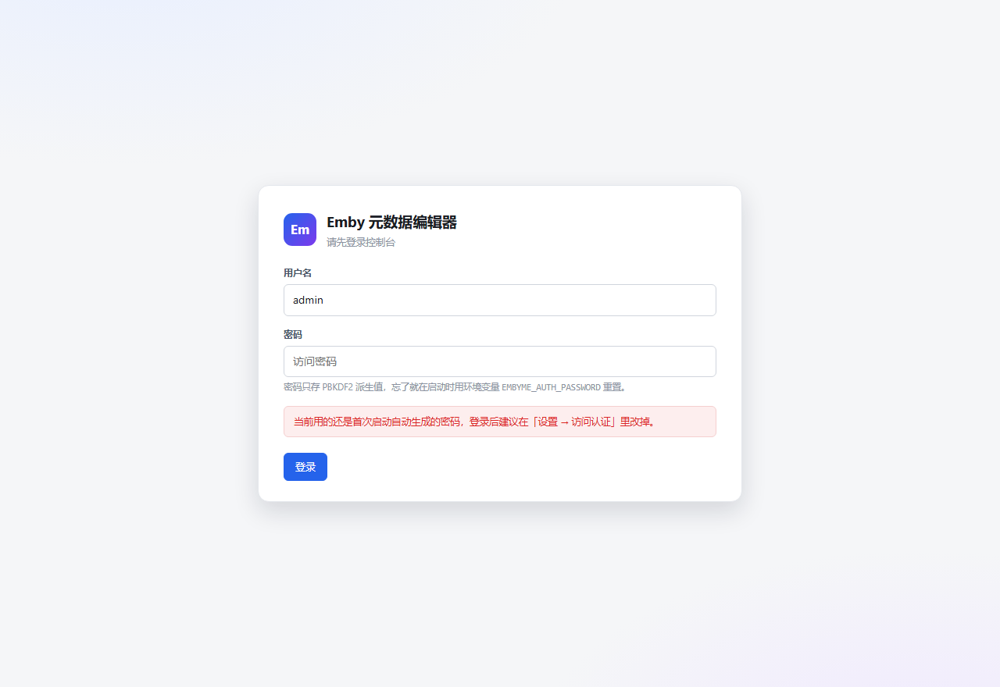 | 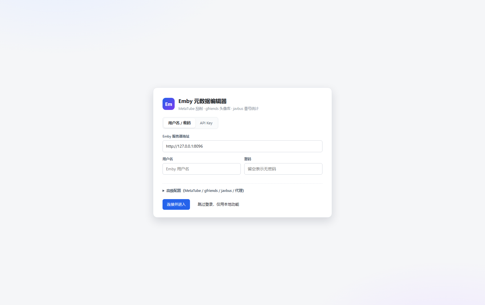 |

| 概览统计 | 媒体库刮削 |
|---|---|
| 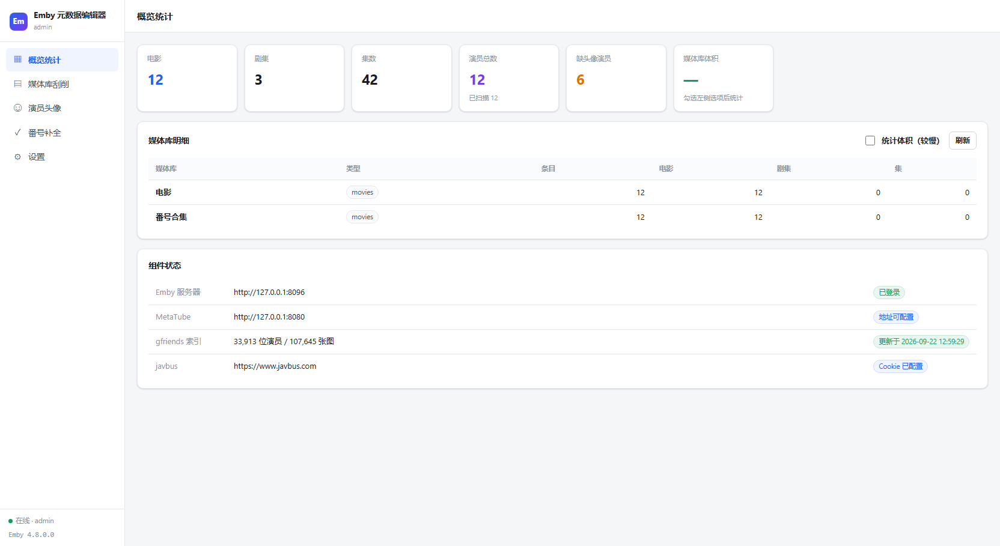 | 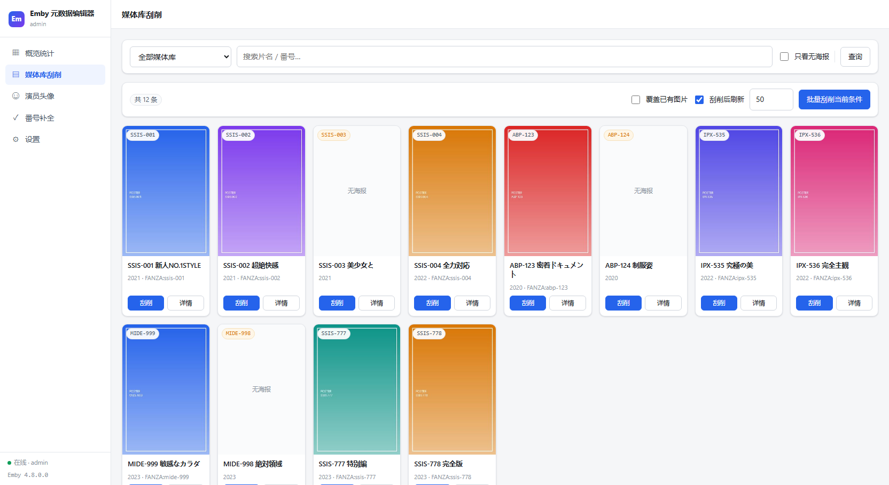 |

| 详情与手动匹配 | 演员头像 |
|---|---|
| 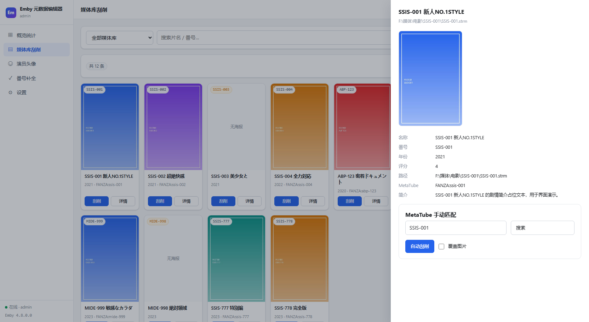 | 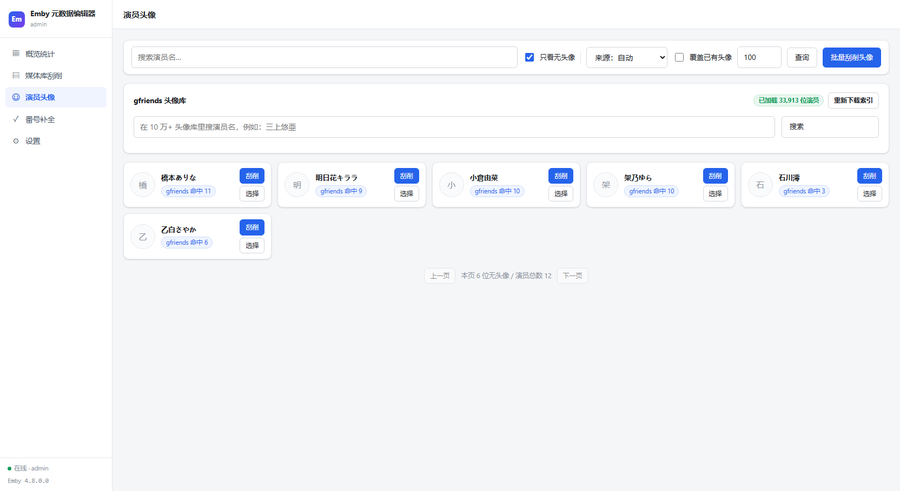 |

| 番号补全 | 连通性诊断 · 正常 |
|---|---|
| 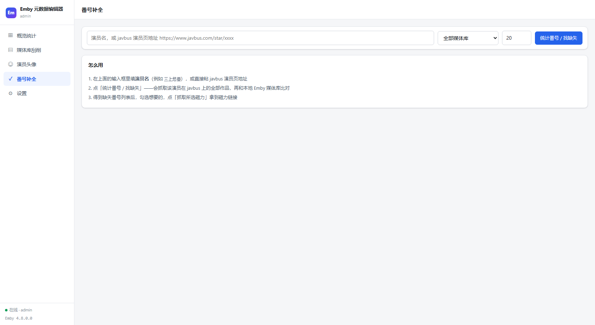 | 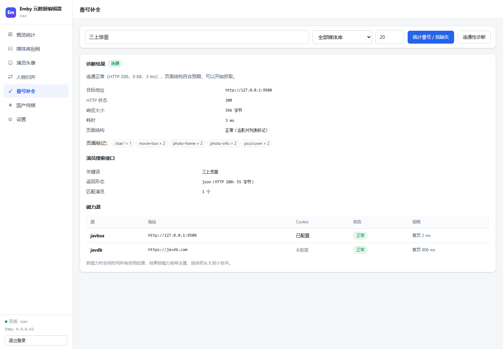 |

| 连通性诊断 · 失败 | 磁力列表 · 按番号分页 |
|---|---|
| 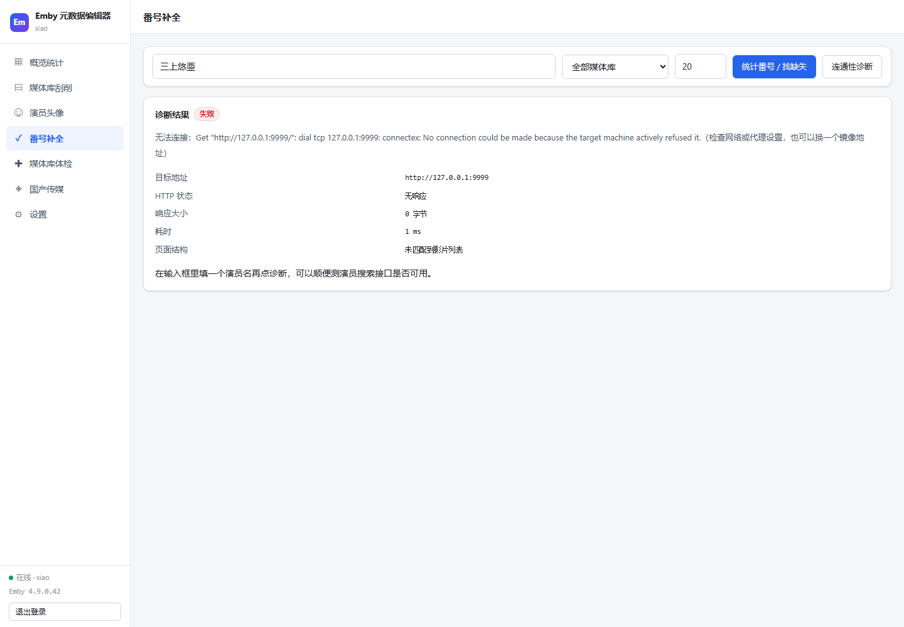 | 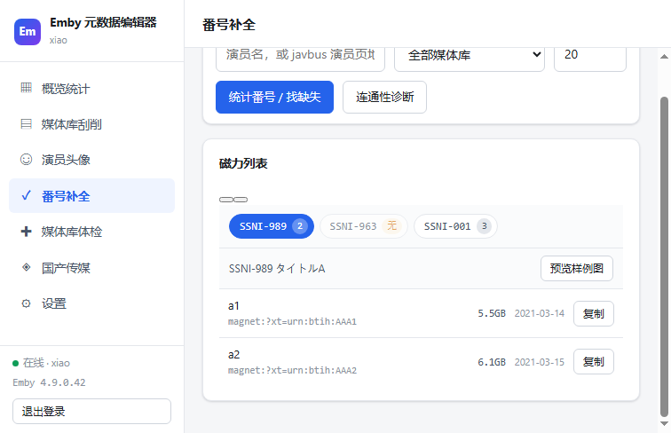 |

| 演员资料（抓取源分列 / 现有值 vs 抓取值 / 媒体库作品） |
|---|
| 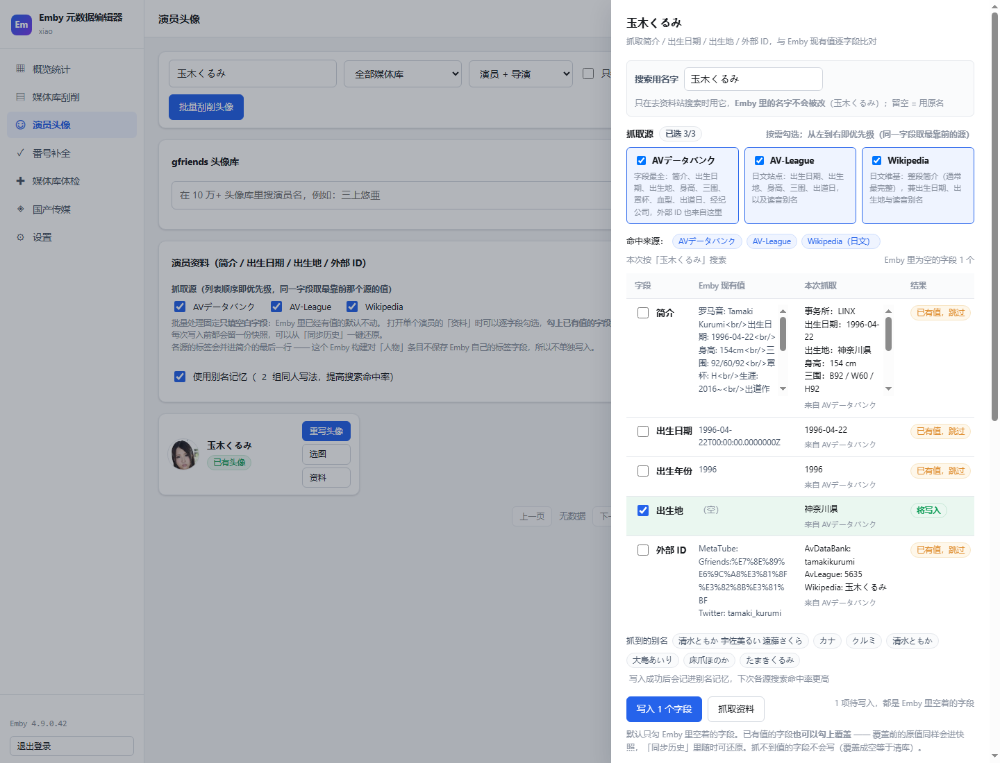 |

（截图数据来自本地 mock Emby / mock javbus。演员资料那张在真实 Emby 上截，截前脚本会隐藏侧栏账号行、`blur` 作品封面。）

---

## 从源码构建

```bash
go build -trimpath -buildvcs=false -ldflags "-s -w" -o EmbyMetaEditor.exe .
```

单文件 exe：`web/` 用 `go:embed`、图标走 PE 资源（`rsrc_windows_amd64.syso`），拷走 exe 就能跑。`-buildvcs=false` 让构建**可复现** —— 照这条命令重建与仓库里的 `EmbyMetaEditor.exe` 逐字节一致（不加则 Go 会嵌当前 commit 的 VCS 信息，体积与哈希都会变，属正常）。

> 仓库里的 exe **跟着 main 走**，下载链 `releases/latest/download/` 只在**发版时**更新，两者不一定同步。
> 当前对齐 **v1.4.0**：Release 与 main 的 md5 同为 `771be1ab4eea249bff2912960785a8a0`（9,283,584 字节）。

`go test ./...` 共 **237 个用例**，覆盖访问认证、番号归一化（含 `91CM-014` 这类数字开头番号、以及「`.mp4` 被当成番号」的误报）、javbus 解析（备用结构 / 裸 `<tr>` 片段 / 真实详情页夹具）、磁力按体积倒序、连通性诊断五种失败形态、MetaTube 字段与 provider 结构兼容、Emby 身份多级回退、图片代理主机分类与缓存、图片尺寸体积探测、人物类型参数归一化、国产传媒四站合并与只认精确匹配、元数据编辑的「只提交改动项」语义、演员资料字段合并与写入策略、作品列表与库名映射、gfriends 两层 CDN 容错，以及 mock Emby + mock MetaTube 跑通的完整刮削链路。

> mock Emby 是**按真实 4.9 构建的行为建模**的，不是「理想 Emby」：读详情只认用户作用域路由（全局路径 404）、写操作只认全局路径、`POST /Items/{id}` 整对象替换、图片上传只收 base64 文本、列表不返回 `SortName`、`/Persons` 传非法 GUID 会 500。线上踩过的坑因此能在单测里复现。
>
> 国产传媒夹具由 `tools/extract_cn_fixtures.py` 从 `cache/debug/` 的真实响应逐字节切出，**不手写** —— 手写最容易「顺手把 `<tr>` 补成 `<table>`」，单测全绿、线上全挂。

### 验证脚本

脚本都要先过访问认证：起 exe 时带 `EMBYME_AUTH_PASSWORD`，脚本默认按 `test-pass` 登录（共用 `tools/wbauth.py`）。

```bash
export EMBYME_AUTH_PASSWORD=test-pass        # PowerShell: $env:EMBYME_AUTH_PASSWORD="test-pass"
EmbyMetaEditor.exe -port 8097 -open=false &  # 起应用，后面几个脚本共用一个实例
```

| 脚本 | 验什么 | 需要什么 |
|---|---|---|
| `smoke_auth.py` | 访问认证 47 项：未登录 `/api/` 全 401、静态资源放行、跨站 Origin 被拒、密钥不下发、留空不清空、改密码踢会话、失败退避、环境变量指定密码 | 无（自建临时实例） |
| `verify_emby_image.py` | Emby 图片**代取**链路（与直连 Emby 逐字节比对） | 真实 config |
| `smoke_real.py` | 真实环境只读冒烟 43 项（含国产传媒四站搜索 / 批量 dry-run / 封面代理） | 起 exe + 真实 config |
| `check_frontend.py` | HTML / JS / 后端路由静态对照；`` 是否都走同源代理；剪贴板调用是否都走 `copyText` | 无 |
| `verify_images.py` | 页面图片**真的渲染出来**（番号补全 / MetaTube / gfriends 三处） | 起 exe + 无头 Edge |
| `verify_gfriends_pick.py` | 选图弹窗：候选全走 `/api/img`、`naturalWidth > 0`、那行「宽×高 · 体积」分档统计 | 起 exe + 无头 Edge |
| `verify_person_lib.py` | 按媒体库 / **人物类型**筛选的**交互**（切库、总数、换批、切回；三档类型总数互不相同） | 起 exe + 无头 Edge |
| `verify_magnet_tabs.py` | 磁力**按番号分页**（标签切换、复制当前 / 全部、空态；每行是完整 `<a href>`、无 clipboard 时回退） | 起 exe + 无头 Edge |
| `verify_clipboard_insecure.py` | **非安全上下文下的复制**（局域网地址 `isSecureContext === false`、回退生效、提示可见）—— Docker 的真实访问方式 | 起 exe（`-host 0.0.0.0`）+ 无头 Edge |
| `verify_cn_view.py` | 国产传媒**选库 → 列表 → 单选/多选刮削 → 编辑元数据**（41 项，写路径全用假 `api()`） | 起 exe + 无头 Edge |
| `smoke_profile.py` | 演员资料只读冒烟（源清单与说明 / 只填空白 / 预览无副作用 / 错误路径）；`PROFILE_LIVE=1` 加重 真实写入 → 回滚 → 校验还原，以及勾选覆盖 → 回滚 → 还原 | 起 exe + 真实 config |
| `verify_profile_view.py` | 资料面板**渲染与抓取时机**（打开不抓、源分列与两处同步、对照表勾选态、作品区块、覆盖按钮文案与配色、与 emby 对照） | 起 exe + 无头 Edge |
| `mock_javbus.py` + `verify_javbus_probe.py` | 模拟站点 + 诊断按钮的界面交互 | 起 exe + 无头 Edge |
| `extract_cn_fixtures.py` | 从 `cache/debug/` 的原始响应切测试夹具 | 落盘的原始 HTML |
| `verify_docker_image.py` | 推上去的镜像**确实是这份代码**（匿名拉 manifest：多架构、`revision` = 本地 tag / HEAD、`source`、入口、非 root；**再解开层在二进制里实查内嵌前后端字面量**） | 能连 Docker Hub |
| `EMBY_LIVE=1 go test -run TestLive` | 实机**写**路径，幂等不改数据 | 真实 config |

几条环境约定：

- **带 `NO_PROXY`**：本机若设了 http 代理，`127.0.0.1` 也会被转发出去，脚本满屏 502。
  `export NO_PROXY=127.0.0.1,localhost,<Emby 地址>`
- **优先用临时数据目录**跑验证（`-dir .tmp-test-home`，先把真实 `config.json` 拷进去，跑完删）—— 这样 `EMBYME_AUTH_PASSWORD` 只写进临时 config，**不动用户自己的 `config.json`**（环境变量会**覆盖并持久化**，拿 `test-pass` 起过一次就永久改掉用户的密码）。
- `verify_*` 那批**依赖外部无头 Edge（9333）**，没起会报 502（非产品 bug）。
- `smoke_profile.py` 的`PROFILE_LIVE=1` 会在 `cache/sync_history.json` 留「已回滚」记录，之后 `verify_profile_view.py` 第 9 步会跳过（有意）。
- 本机没有 MetaTube Server → `verify_images.py` [B] 后半段、`smoke_real.py` 的 MetaTube 一项必然失败（已知，非回归）。

---

## Docker 镜像

`Dockerfile` 两阶段（`golang:1.27-alpine` → `alpine:3.22`），`CGO_ENABLED=0` 纯静态 ELF，运行层装 `ca-certificates`（否则 https 取图全挂）。容器以非 root（uid 1000）运行，用宿主目录映射时先 `chown 1000:1000`。`.dockerignore` 排掉了 `config.json` 与 `cache/`（前者装着真实 Emby 令牌和 OpenAI key，绝不该进构建上下文）。

两个环境变量可注入访问认证：`EMBYME_AUTH_USER` / `EMBYME_AUTH_PASSWORD`，传了就每次启动都覆盖。

```bash
docker build -t aag111/emby-meta-editor:latest .
docker run --rm -p 8097:8097 -e EMBYME_AUTH_PASSWORD=你的密码 -v emby-data:/data aag111/emby-meta-editor:latest
```

### 发布到 Docker Hub

`.github/workflows/docker.yml` 在**打 `v*` tag 时**自动构建 `linux/amd64` + `linux/arm64` 并推送，也可在 Actions 手动触发（改完 Dockerfile 想先验一次）。首次需配两个 secret：`DOCKERHUB_USERNAME` 与 `DOCKERHUB_TOKEN`（权限 Read & Write）。

```bash
git tag v1.4.0 && git push origin v1.4.0
```

镜像标签由 tag 推导：`v1.4.0` → `1.4.0` / `1.4` / `1` / `latest`（`latest` 跟最新正式版）。**手动触发没有 tag 可比，只推 `latest`**。镜像名固定 `<DOCKERHUB_USERNAME>/emby-meta-editor`，换 Docker Hub 用户名只动 secret。

> **Docker Hub 用户名 `aag111` ≠ GitHub 用户名 `huangmoling`**，别照搬。手动触发构建的 `revision` = 触发时的 `main` HEAD，**之后再往 main 提交镜像就落后了** —— `verify_docker_image.py` 会如实报 FAIL，重新触发即可。dispatch 镜像的版本标签是 `latest`，所以那个脚本改从**镜像对应提交的 `version.go`** 取版本串来比，而不是拿 `latest` 拼 `vlatest`。
>
> **改了 `web/` 下任何东西都必须重新打镜像** —— 前端是 `go:embed` 编进二进制的，源码修对不等于镜像修对。这是唯一一种「CI 全绿、镜像能拉、容器能起，但界面还是坏的」故障（v1.0.8 的镜像就这么带着 gfriends 弹窗的 bug 发出去过）。`verify_docker_image.py` 解开镜像层在二进制里实查内嵌前端，专门守这条。

---

## 目录结构

```
main.go              启动、参数、控制台 UTF-8、自动开浏览器、打印初始密码
auth.go              访问认证：PBKDF2 派生、内存会话、失败退避、安全响应头 / CSRF 中间件
config.go            配置结构与持久化（含敏感字段脱敏）
api.go               HTTP 路由与处理函数
emby.go              Emby REST 客户端
imageproxy.go        图片代理：Referer 防盗链、白名单、6 小时缓存
imageinfo.go         图片尺寸 / 体积探测（选图弹窗那行小字；复用同一套白名单）
metatube.go          MetaTube v1 客户端
gfriends.go          gfriends 索引下载 / 缓存 / 查询
javbus.go            javbus 抓取、HTML 解析、连通性诊断
cnmedia.go           国产传媒四站抓取、番号归一化、精确匹配合并
scrape.go            刮削编排、番号比对
actorprofile.go      演员资料来源适配、姓名匹配、字段合并
profile.go           演员资料编排：只填空白 / 按勾选覆盖、同步快照与回滚、别名记忆、作品列表
api_profile.go       演员资料路由（sources / preview / apply / batch / history / rollback / aliases / works）
jobs.go              后台任务与进度
util.go              番号归一化、HTML 辅助、HTTP 客户端
console_windows.go   Windows 控制台切 UTF-8
web/                 前端（原生 JS，无构建步骤）
tools/               验证脚本：模拟站点 / CDP 界面回归 / 前端自检 / 封面渲染 / 人物按库与类型筛 / 磁力分页 / 剪贴板回退 / 国产传媒 / 演员资料 / 夹具切取 / 实机冒烟
app.ico              图标源文件
Dockerfile           Docker 镜像定义（两阶段，静态链接）
.github/workflows/docker.yml  打 tag 自动构建并推送 Docker Hub
```

---

## 已知边界

- 刮削只处理 `Movie` 条目；剧集 / 分集不在范围内。
- 番号靠正则从片名与路径提取，**路径里带番号最稳**。数字开头的国产番号（`91CM-014`、`91BCM-002`、`18BT.NET-…`）走单独提取逻辑，见踩坑表。
- 国产传媒四站都是聚合站，改版会让解析失效 —— 每站一个 `parseXxx`，夹具在 `testdata/cn/`。站点挂了不会让整次刮削失败，失败原因写在该站卡片里，其余照常出结果。
- 麻豆区搜索是**模糊**的，「搜了没命中」通常正常，不代表站点挂了；要判可达看那站的 `OK` / `Error`。
- `xchina.co` 详情页有 Cloudflare（403），只取搜索页。
- 编辑元数据时**发行日期与年份留空 = 不修改**（Emby 的 `POST /Items/{id}` 是整对象替换，发空日期要么 400 要么抹掉）。
- 这个构建（4.9.0.42）详情接口**不返回 `Tags`**（恒 `null`），标签只体现在 `TagItems`。写仍发 `Tags`，读时两者都看。
- **人物列表的内容取决于你的 Emby 数据**：有些刮削器把片商 / 系列名写进条目的 `People`，于是它们以「演员」身份出现。类型下拉能滤掉「纯导演 / 编剧 / 制片」，**滤不掉被当成 `Actor` 的片商名**（全量 10561 vs 演员+导演 10559，只差 2 条）。
- 「该人物在媒体库里的作品」按 Emby 侧的 `People` 关联查：同一人被写成不同名字、或条目没关联到这个人时不会出现。库名靠 `Library/VirtualFolders` 的盘路径匹配，挂载点变了就只显示不出库名（不影响列表）。一次最多 400 条。
- **单卡勾选覆盖是唯一会改人物已有资料的入口**（批量永远只填空白）。写前自动留快照，可逐字段回滚，但快照上限 1000 条。
- `SortName` / `ForcedSortName` 在部分构建上设不进去，见下。
- 访问认证**没有关闭开关**；真的不想要就别把端口开出去（默认只听 `127.0.0.1`）。

---

## 踩过的坑

都属于「照文档写就会错」的类型，全已在代码里修掉。

| 现象 | 根因 | 处理 |
|---|---|---|
| Emby 报 `token_valid: false`，但媒体库明明能列出 | `/Users/Me` 在 4.9.x 上用 API Key 调会 500（`Unrecognized Guid format`）—— 该令牌没关联用户 | `Emby.Me` 多级回退：`/Users/Me` → `/Users/{已知id}` → `/Users` 列表 |
| 媒体库刮削 / 点详情报 `404 找不到文件 "/Items/513232"` | 这个构建**只注册了用户作用域的详情路由**，`GET /Items/{id}` 会落到静态文件处理器；写操作（`POST /Items/{id}`、`/Refresh`、`DELETE …/Images/…`）**只有全局路径** | `ItemDetail` 先试 `/Users/{uid}/Items/{id}` 再退回全局；写操作保持全局路径 |
| 刮削后条目简介、年份、评分全没了 | `POST /Items/{id}` 是**整对象替换**而非部分更新，body 缺失的字段会被清空 | `UpdateItem` 以**当前完整 DTO** 为底再叠 patch；只排除 `Etag`/`MediaSources`/`MediaStreams`/`Chapters` 这类服务端派生大字段 |
| 更新报 `400 Value cannot be null. (Parameter 'source')` | body 缺 `ProviderIds`（或为 `null`）服务端直接拒绝 | `UpdateItem` 始终回填非 nil 的 `ProviderIds`，并与已有外部 ID 合并 |
| 上传头像报 `500 The input is not a valid Base-64 string…` | 这个构建的 `POST /Items/{id}/Images/{Primary}` 要 **base64 文本** body，标准 Emby 要原始字节 | 先发原始字节，命中 base64 报错再换格式重试。**顺序不能反** —— 标准服务器上 base64 文本会被当图片数据静默存进去 |
| 上传图片报 `400 Unable to determine image file extension from mime type` | 服务端用 Content-Type 决定存盘扩展名 | `normalizeImageType` 归一化 MIME，缺失时按文件头猜；认不出是图片就本地报错，不发请求 |
| 缺失番号列表里封面全是空白 | javbus 图片的 Referer 防盗链 | 服务端 `/api/img` 代理 + 6 小时缓存 |
| 媒体库卡片角标显示的是年份，不是番号 | **`/Items` 列表接口不返回 `SortName`**（实测全 `null`，详情接口才返回） | 番号改由服务端算：`itemNumber()` 复用刮削归一化，`/api/items` 与 `/api/items/detail` 都回填 `Number` |
| javbus 磁力永远「暂无链接」，但接口明明有数据 | ajax 返回**裸 `<tr>` 片段**，HTML5 树构造会把游离 `<tr>` 直接丢弃 | `parseMagnets` 先套一层 `<table><tbody>` 再解析 |
| MetaTube 报「解析 providers 失败」 | v1 实际返回 `{"data":{"movie_providers":{…}}}`，不是文档里的扁平数组 | 三种结构都兼容 |
| 刮削后制作商 / 简介为空 | 实际字段名是 `maker` / `summary`，代码里写的 `studio` / `plot` | 两套都留，`firstNonEmpty` 兜底 |
| 番号统计偶发抓不到演员 | 搜索接口有时返回 JSON、有时 HTML | 两种都解析，失败时落盘原始响应 |
| 按媒体库查演员，库 ID 写错时整个请求 500 | `/Persons` 的 `ParentId` 非 GUID 时 Emby 直接 500（**不是**返回空列表）；全零 GUID 这种「格式合法但不存在」的正常返回 0 条 | 前端只传真实库 Id 或空串；mock 照抄了这个 500 行为，避免以后误传坏 ID 时单测看不出来 |
| 国产传媒条目角标显示 `CM-014` 而不是 `91CM-014` | 通用番号正则要求「字母前缀 + 数字」，数字开头的被当噪声前缀截掉。影响面比想象中大 —— 角标、写入的 `Tags`、搜索关键词全用它 | `itemNumber()` 先跑 `cnExtractNumber`（允许 0–4 位数字前缀），命中且前缀更长时优先返回；`HEVC10 1080P` 这类压制组标记进 `cnNoisePrefix` 过滤 |
| 国产传媒封面全是白框，但 `/api/img` 明明 200 | `upload.xchina.io` 对**浏览器**返回 Cloudflare 挑战页（`ERR_BLOCKED_BY_RESPONSE`），服务端带浏览器 UA 是正常图片 | 该图床加进 `imageproxy.go` 代理白名单，浏览器只跟本机 `/api/img` 打交道 |
| 加访问认证后所有海报 / 头像变空白 | 图片原来是浏览器**直连 Emby**（`` 里拼 `api_key`），收紧 CSP（`img-src 'self'`）且令牌不再进 DOM 后，残留直连地址一律取不到图 | Emby 图片统一走 `/api/emby/image` 服务端代取（复用 6 小时缓存），前端 `embyImg()` 只产同源地址；`verify_emby_image.py` 与直连 Emby 逐字节比对 |
| 选头像弹窗里 gfriends 结果**全是破图**，但 `curl` 那些 CDN 地址都是 200 | 这个弹窗是全项目**唯一**漏掉 `imgSrc()` 的渲染点，`` 直接写 CDN 外链；CSP 收紧后被浏览器静默拦掉（同页其他图都走代理，所以看着像「个别地址坏了」） | 改走 `imgSrc(en.f)` → 同源 `/api/img?u=…`；`check_frontend.py` 加静态规则扫出所有没走 `imgSrc()` / `embyImg()` 的 `` 模板 |
| 登录失败**两次**后，本人输对密码也被挡 | 退避表取了 `idx = fails`，第二次失败就吃到 3 秒锁，「前两次不罚」形同虚设 | 改成 `idx = fails - 1`；`smoke_auth.py` 把「连续失败才退避」固定成断言 |
| 「保存设置」把存好的 Emby API Key / javbus cookie 抹掉了 | `/api/config` 不再下发明文密钥后，前端输入框本来就是空的，后端却还无条件赋值 —— 空串被当成「清空」 | 密钥一律「留空 = 不修改」（含 `/api/emby/login` 的 API Key）；`smoke_auth.py` 有一条断言守着 |
| 修完「数字开头番号」之后，**每个 mp4 条目都多出一个「番号 `MP-4`」** | 为了支持 `91CM-014` 放宽了正则（允许数字前缀、数字部分只要 1 位），结果 `.mp4` 被拆成 `MP` + `4`。角标、写进 `Tags` 的内容、搜索关键词全跟着错 —— 修之前抽样 200 条「有番号」的有 196 条 | `numberSourceFields()` 抽番号前先抹掉扩展名（`reFileExt`），`MP` / `CD` 这类容器 / 分卷标记进 `cnNoisePrefix`。`TestCNItemNumberIgnoresFileExtension` 守着 |
| 给演员写 `Tags` 总是「成功」，读回来却永远空 | 这个构建对 `Person` 的 `Tags` 是**收下不保存**：POST 返回 204，但详情 / 列表 / `TagItems` / 全局标签字典里都没有。同批实测 `Overview` / `PremiereDate` / `ProductionYear` / `ProductionLocations` / `ProviderIds` 都能正常存 | 人物资料**不写 `Tags`**，各源抓到的标签并进简介最后一行。否则每跑一次都「重复写入成功」，还顺手覆盖用户自己填的标签 |
| 想清空某字段时发 `null` 或干脆不带键，服务端都不为所动 | 这个构建里**只有发空数组 `[]` 才能清空数组字段**（如 `ProductionLocations`），`null` 和省略键都等于「不改」 | 回滚时把快照里缺失的数组 / map / 数字字段补成 `[]` / `{}` / `0` 再发，而不是 `nil` |
| 回滚后字段该还原的没还原、外部 ID 被整个抹掉 | 两个独立坑叠加：① 快照缺失值转成 `[]string(nil)`，装箱进 `any` 后 `v == nil` 是 **false**（类型化 nil ≠ nil），既没走「清空」分支又被 nil 守卫跳过；② `patch["ProviderIds"].(map[string]any)` 遇到 `map[string]string`（回滚快照正是这种）会**静默断言失败**，发出去一个空 map | ① `isNilVal()`（`reflect` 判 `Slice/Map/Ptr/…` 的 `IsNil`）用于 `updateItem` 守卫与 `rollbackSync` 补空；② 抽 `providerIDsFrom(v any)` 同时处理两种 map。`TestRollbackClearsFieldsThatWereAbsent` / `TestApplyThenRollbackRestores` 守着 |
| 同步历史里每条记录都点不动（`record_id` 是空串） | `SyncStore.Add(rec SyncRecord)` 是**值传递**，内部生成的 ID 传不回调用方 | `Add` 改成返回 ID，调用方 `res.RecordID = a.sync.Add(rec)` |
| 批量补资料只跑一页就停；按名字传入的演员每个字段都判成「可写」 | 前者：`/Persons` 带 `SearchTerm` 时 `TotalRecordCount` **恒为 0**，拿 `total` 当终止条件就提前收工。后者：名字解析失败时 `person_id` 留空，读不到现有值，于是所有字段都像空白 | 前者：分页改成「本页数量 < 每页上限才停」。后者：`profileTargets` 对纯名字先 `PersonByName`，解析不到的**直接丢掉**，契约收紧为「每个目标 ID 必须非空」 |
| gfriends 换了 CDN 节点 / 仓库后，索引照样能下回来，但候选图**全部下载失败** | 原实现只给**索引**配了备用地址，图片永远只用配置里那一个基址 —— `cdn.jsdelivr.net` 一挂，「刮削头像 / 选图」整体不可用 | `gfriendsCDNBases()` 把同一套备用列表用到图片上：主基址**一张都没取下来**才依次换（正常网络零额外请求），单次尝试上限 30 秒。索引与图片都按「仓库 × 节点」两维展开。`TestPickBestGfriendsFallsBackToMirror` 守着 |
| 备用基址的图服务端能取到、界面上却是破图 | 白名单里写的是**精确**主机 `cdn.jsdelivr.net`，`gcore.` / `fastly.` / `raw.githubusercontent.com` 全不在名单里。`curl` 那几个地址都是 200，只有浏览器经 `/api/img` 才被拒 | 白名单改成后缀匹配 `.jsdelivr.net` / `.githubusercontent.com`；`TestGfriendsCDNBasesAreProxyAllowed` 遍历全部候选基址反查白名单 |
| 「裸文件名也能命中」这条分支永远不成立 | 索引里的 `File` 形如 `三上悠亜-1.jpg?t=1657944780`，比对时只对**传入值**剥了 `?t=`、没剥索引那侧的 | 抽 `gfriendFileBase()` 两边都剥；文件名本身仍要求精确相等。`TestMatchGfriendEntryAcceptsAnyBase` 覆盖带戳 / 不带戳 / 换一张图 |
| 想给作品标「属于哪个媒体库」，拿条目 `ParentId` 去对 `Views` 的 `Id` 永远对不上 | 条目的 `ParentId` 是**库内子目录**（实测像个短 ID `508698`），不是 `Views` 里的库 ID；且 `/Users/{uid}/Views` **即使带 `Fields=Path` 也不返回 `Path`**（实测 `path=None`） | 库名映射改用 `GET /Library/VirtualFolders`（返回 `[{Name, ItemId, Locations[]}]`），拿 `Locations` 盘路径按**分段对齐**匹配条目 `Path` 并取**最长前缀**（`/data/Movies/4K` 要赢过 `/data/Movies`）。判定放在 `libraryOfPath()` 里；查不到就留空，不让整条链路挂掉 |
| 磁力「按体积排序」后顺序还是乱的（`9` 排在 `1` 后面） | 体积是 `1.83GB` / `2.57 GB` 这样的字符串，直接比就是字典序；解析不出体积的若用 `0` 当默认，会被排到「比所有真实体积都小」的位置 | `magnetSizeBytes()` 换算字节（TB/GB/MB/KB），解析不出返回 **`-1`**；`sortMagnetsBySize()` 用 `sort.SliceStable` 保持同体积原序。排序只在**组装层** `magnetResultFrom()`，`parseMagnets` 仍保持文档顺序 |
| 给已有值做覆盖验证时，Emby 明明写进去了，读回来却「没变」 | 不是没写：Emby 会**规范化**日期（写 `1996-04-22`，读回 `1996-04-22T00:00:00.0000000Z`），年份同理；`provider_ids` 还是**合并写**（原有的 `MetaTube:` / `Gfriends:` 行都留着）。直接比字符串满屏假 FAIL | 覆盖率断言按**语义**比：日期只比前 10 位，外部 ID 只要求「抓到的每一行都进了 Emby」。同时钉清「只填空白」是**默认**策略，单卡带 `keys` 时以勾选为准 |
| 想在选图弹窗标出**文件体积**，前端怎么都拿不到 | 浏览器没有任何 API 能读一张 `` 的字节数；`fetch` 拿 `blob.size` 会被 CSP `connect-src 'self'` 挡在跨域之外，而这条 CSP 是防 XSS 的一部分，不能为一个数字开口子。像素也一样：`naturalWidth` 得等整张图下完 | 服务端加 `POST /api/img/info` 批量代取，**复用 `/api/img` 白名单**（非白名单逐条 `ok:false` 而不是整批 5xx）；`image.DecodeConfig` **只解析文件头**（全解码一张 2000px 图要几十毫秒）。探测顺带写进 `ImageProxy` 缓存，弹窗缩略图随后秒开。界面**先出图、后补小字**，所以 `verify_gfriends_pick.py` 必须把「还没探完」和「读不回来」分开数 |
| 资料抽屉里加了一组「选源」勾选框后，点「写入勾选字段」报「写入 0 个字段」，按钮上却写着「写入 3 个字段」 | 抽屉里有**两组** `input[data-key]`（选字段 / 选源），提交时 `$$('#pfBody input[data-key]:checked')` 把源名（`AvDataBank` 等）也当字段名发了上去 | 提交范围收到对照表：`$$('#pfBody .pf-tbl input[data-key]:checked')`。两组勾选框语义完全不同，别用同一个选择器一锅端 |
| 界面回归脚本的断言详情里传了个 dict，脚本在最需要它的时候炸掉 | `check()` 是把详情**直接拼进输出字符串**的，一旦断言**失败**（正要看快照的时候）就抛 `TypeError`，堆栈把真正的失败信息顶掉。`verify_profile_view.py` 还有一处更早的：把 `Page.errors()` 当 dict 用（`e.get("method")`）—— 它返回的是**字符串**，所以那段代码只在没有任何报错时才不炸 | 详情统一 `str(detail)`，**逐条打印与结尾失败汇总两处都要**；错误分类改成按前缀判（`HTTP …` / `未捕获异常` / `console.error`） |
| 复制磁力按钮在**本机 exe 正常，Docker 部署后点了没反应**（连失败提示都没有） | `navigator.clipboard` 只在**安全上下文**里存在：`http://127.0.0.1` 算，`http://192.168.x.x`（Docker / NAS / 局域网访问）**不算**。非安全上下文里它是 `undefined`，`writeText()` 直接抛 `TypeError`；这行异常写在 `onclick` 里会被浏览器吞掉，于是既不复制、也不报错。**本机测不出来**，必须走局域网地址 | 抽 `copyText()`：先特性检测（`try` 包住，同步抛也算），不可用就回退隐藏 `<textarea>` + `document.execCommand('copy')`（回退元素得 `position:fixed;width:1px;height:1px;opacity:0`，`display:none` 会让 `execCommand` 返回 false）；两条路都失败才弹**看得见**的错误提示。`verify_clipboard_insecure.py` 用局域网地址实测 |
| 点磁力链接弹不出 javbus 的预览图（项目初期是好的），控制台也不报错 | 预览图是 **javbus 页面脚本注入到我们页面里的外部 ``**，而 v1.0.8 把 CSP 收成 `img-src 'self' data: blob:` 之后被一律拦掉（`securitypolicyviolation` 实测：`img-src <- https://www.javbus.com/pics/sample/c421_1.jpg`）。拦得极安静 —— 图片只是不显示 | `img-src` 放开 `http: https:`（`connect-src` 仍 `'self'`，自家取图仍走 `/api/img` / `/api/emby/image`）。**别再把 CSP 当成「外链图片静默失效」的兜底守卫**，这条改由 `check_frontend.py` 静态扫描承担。另外这些 sample 图有 Referer 防盗链（无 Referer 或带我们 origin 都 403），只有用户自己浏览器里那套 javbus 工具带得上 |
| 磁力地址在列表里显示成 `magnet:?xt=…` 后面接省略号，点它没反应、也触发不了预览 | 之前把地址当**纯文本**渲染，还 `slice(0,110) + '…'` 截断。磁力处理脚本按 `<a href>` 里**完整**的 URI 认链接 —— 截断后既不是合法磁力、也不在 DOM 的 href 里，依赖 href 的工具（javbus 预览、下载器接管）全失效 | 每行渲染成真正的 `<a href="完整地址">`，可见文本也是完整地址，长地址靠 CSS `text-overflow: ellipsis` 省略。`verify_magnet_tabs.py` 用一条 200+ 字符、带 `dn` 与两条 `tr` 的真实地址钉住「参数一个不少」 |
| 人物类型筛到「仅演员」，列表里还是有片商名（如 `プレミアムビデオ`） | Emby 人物库里**连片商名都建成了 Person、类型就是 `Actor`**，按 `PersonTypes` 过滤不掉（实测全量 10561、演员 9497、导演 1189、演员+导演 10559，只差 2 条）。且返回条目的 `Type` 恒为 `Person`，「是演员还是导演」只在查询参数里 | 如实写明：类型筛选滤得掉「纯导演 / 编剧 / 制片」，滤不掉被当成演员的片商名。默认 `Actor,Director`，`?types=` 支持 `all` 与未知值兜底回默认；`TestPersonTypesParam` / `TestHandlePersonsPassesPersonTypes` 守着 |
| 想模拟「浏览器没有 clipboard」测回退，`delete navigator.clipboard` 之后它**还在** | `clipboard` 是挂在 `Navigator.prototype` 上的 **getter**，`delete` 删实例属性对它无效；于是回退分支根本没被执行，测试却「通过」了 —— 假绿比红更危险 | 用 `Object.defineProperty(navigator, 'clipboard', {value: undefined, configurable: true})` 在实例上盖住。断言前先清掉已有 toast，否则会看到上一条残留的「已复制」而误判 |

### 一个改不回来的字段

`SortName` / `ForcedSortName` 在这个 Emby 构建（4.9.0.42）上**无法通过 API 设置**。实测三种 payload 形态、只发 `ForcedSortName`、以及 `/Items/{id}/Metadata` 端点，全部无效（POST 返回 204 但服务端总是按 `Name` 重新计算），条目本身没有锁定（`LockedFields` 为空）。

好在原始日文标题同时存在于 `OriginalTitle` 里，没真的丢。刮削时也就没必要往 patch 里塞这两个字段了。

MIT License.
